## Final Project Submission

Please fill out:
* Student name: Ice Asortse
* Student pace:Full time
* Scheduled project review date/time: 11/7/2019
* Instructor name: Rafael
* Blog post URL:


# Introduction
## Investigating the factors that drive housing prices

### Loading up libraries


```python
# Importing libraries
import pandas as pd
import matplotlib.pyplot as plt
import matplotlib as mpl
import seaborn as sns
import numpy as np
%matplotlib inline
inline_rc = dict(mpl.rcParams)

plt.style.use('seaborn')

import statsmodels.api as sm
import statsmodels.formula.api as smf
from scipy.stats import normaltest as normtest # D'Agostino and Pearson's omnibus test

from collections import Counter
from sklearn.preprocessing import RobustScaler
from sklearn.preprocessing import MinMaxScaler
```


```python
%ls
```

     Volume in drive C is Windows
     Volume Serial Number is 4CD3-443B
    
     Directory of C:\Users\Ice Asortse\FlatironData\ProjectMod1\dsc-v2-mod1-final-project-online-ds-ft-100719
    
    11/07/2019  03:51 PM    <DIR>          .
    11/07/2019  03:51 PM    <DIR>          ..
    10/21/2019  12:12 PM               146 .gitignore
    11/05/2019  10:17 AM    <DIR>          .ipynb_checkpoints
    10/21/2019  12:12 PM                93 .learn
    10/21/2019  12:12 PM         1,425,341 awesome.gif
    10/21/2019  12:12 PM             1,120 column_names.md
    10/21/2019  12:12 PM             1,846 CONTRIBUTING.md
    10/21/2019  12:12 PM         2,475,934 kc_house_data.csv
    10/21/2019  12:12 PM             1,354 LICENSE.md
    10/21/2019  12:12 PM            79,134 module1_project_rubric.pdf
    10/30/2019  12:48 PM           742,738 OSEMIN_scaffolding.ipynb
    10/21/2019  12:12 PM            13,290 README.md
    11/07/2019  03:51 PM         1,020,042 student.ipynb
    10/29/2019  10:30 AM         1,601,070 study_group_starter.ipynb
    11/05/2019  02:46 PM           180,922 Untitled.ipynb
                  13 File(s)      7,543,030 bytes
                   3 Dir(s)  306,253,488,128 bytes free
    


```python
# import and getting basic info about the data
df = pd.read_csv('kc_house_data.csv')
display(df.head())
#df.info()
```


<div>
<style scoped>
    .dataframe tbody tr th:only-of-type {
        vertical-align: middle;
    }

    .dataframe tbody tr th {
        vertical-align: top;
    }

    .dataframe thead th {
        text-align: right;
    }
</style>
<table border="1" class="dataframe">
  <thead>
    <tr style="text-align: right;">
      <th></th>
      <th>id</th>
      <th>date</th>
      <th>price</th>
      <th>bedrooms</th>
      <th>bathrooms</th>
      <th>sqft_living</th>
      <th>sqft_lot</th>
      <th>floors</th>
      <th>waterfront</th>
      <th>view</th>
      <th>condition</th>
      <th>grade</th>
      <th>sqft_above</th>
      <th>sqft_basement</th>
      <th>yr_built</th>
      <th>yr_renovated</th>
      <th>zipcode</th>
      <th>lat</th>
      <th>long</th>
      <th>sqft_living15</th>
      <th>sqft_lot15</th>
    </tr>
  </thead>
  <tbody>
    <tr>
      <th>0</th>
      <td>7129300520</td>
      <td>10/13/2014</td>
      <td>221900.0</td>
      <td>3</td>
      <td>1.00</td>
      <td>1180</td>
      <td>5650</td>
      <td>1.0</td>
      <td>NaN</td>
      <td>0.0</td>
      <td>3</td>
      <td>7</td>
      <td>1180</td>
      <td>0.0</td>
      <td>1955</td>
      <td>0.0</td>
      <td>98178</td>
      <td>47.5112</td>
      <td>-122.257</td>
      <td>1340</td>
      <td>5650</td>
    </tr>
    <tr>
      <th>1</th>
      <td>6414100192</td>
      <td>12/9/2014</td>
      <td>538000.0</td>
      <td>3</td>
      <td>2.25</td>
      <td>2570</td>
      <td>7242</td>
      <td>2.0</td>
      <td>0.0</td>
      <td>0.0</td>
      <td>3</td>
      <td>7</td>
      <td>2170</td>
      <td>400.0</td>
      <td>1951</td>
      <td>1991.0</td>
      <td>98125</td>
      <td>47.7210</td>
      <td>-122.319</td>
      <td>1690</td>
      <td>7639</td>
    </tr>
    <tr>
      <th>2</th>
      <td>5631500400</td>
      <td>2/25/2015</td>
      <td>180000.0</td>
      <td>2</td>
      <td>1.00</td>
      <td>770</td>
      <td>10000</td>
      <td>1.0</td>
      <td>0.0</td>
      <td>0.0</td>
      <td>3</td>
      <td>6</td>
      <td>770</td>
      <td>0.0</td>
      <td>1933</td>
      <td>NaN</td>
      <td>98028</td>
      <td>47.7379</td>
      <td>-122.233</td>
      <td>2720</td>
      <td>8062</td>
    </tr>
    <tr>
      <th>3</th>
      <td>2487200875</td>
      <td>12/9/2014</td>
      <td>604000.0</td>
      <td>4</td>
      <td>3.00</td>
      <td>1960</td>
      <td>5000</td>
      <td>1.0</td>
      <td>0.0</td>
      <td>0.0</td>
      <td>5</td>
      <td>7</td>
      <td>1050</td>
      <td>910.0</td>
      <td>1965</td>
      <td>0.0</td>
      <td>98136</td>
      <td>47.5208</td>
      <td>-122.393</td>
      <td>1360</td>
      <td>5000</td>
    </tr>
    <tr>
      <th>4</th>
      <td>1954400510</td>
      <td>2/18/2015</td>
      <td>510000.0</td>
      <td>3</td>
      <td>2.00</td>
      <td>1680</td>
      <td>8080</td>
      <td>1.0</td>
      <td>0.0</td>
      <td>0.0</td>
      <td>3</td>
      <td>8</td>
      <td>1680</td>
      <td>0.0</td>
      <td>1987</td>
      <td>0.0</td>
      <td>98074</td>
      <td>47.6168</td>
      <td>-122.045</td>
      <td>1800</td>
      <td>7503</td>
    </tr>
  </tbody>
</table>
</div>


```python
# Ignore pink warnings 
import warnings
warnings.filterwarnings('ignore')

# Allow for a large # of columns
pd.set_option('display.max_columns',0)
# pd.set_option('display.max_rows','')
```


```python
#getting basic info about the data
df.info()
```

    <class 'pandas.core.frame.DataFrame'>
    RangeIndex: 21597 entries, 0 to 21596
    Data columns (total 21 columns):
    id               21597 non-null int64
    date             21597 non-null object
    price            21597 non-null float64
    bedrooms         21597 non-null int64
    bathrooms        21597 non-null float64
    sqft_living      21597 non-null int64
    sqft_lot         21597 non-null int64
    floors           21597 non-null float64
    waterfront       19221 non-null float64
    view             21534 non-null float64
    condition        21597 non-null int64
    grade            21597 non-null int64
    sqft_above       21597 non-null int64
    sqft_basement    21597 non-null object
    yr_built         21597 non-null int64
    yr_renovated     17755 non-null float64
    zipcode          21597 non-null int64
    lat              21597 non-null float64
    long             21597 non-null float64
    sqft_living15    21597 non-null int64
    sqft_lot15       21597 non-null int64
    dtypes: float64(8), int64(11), object(2)
    memory usage: 3.5+ MB
    

My data contains 21,597 entries. From the info, you can tell that we have both numerical and categorical data. 
The 3rd column  is what we want to predict (Price)

# Scrub


```python
# getting the 5 number summary of the the dataset 
df.describe().round(5)
```


<div>
<style scoped>
    .dataframe tbody tr th:only-of-type {
        vertical-align: middle;
    }

    .dataframe tbody tr th {
        vertical-align: top;
    }

    .dataframe thead th {
        text-align: right;
    }
</style>
<table border="1" class="dataframe">
  <thead>
    <tr style="text-align: right;">
      <th></th>
      <th>id</th>
      <th>price</th>
      <th>bedrooms</th>
      <th>bathrooms</th>
      <th>sqft_living</th>
      <th>sqft_lot</th>
      <th>floors</th>
      <th>waterfront</th>
      <th>view</th>
      <th>condition</th>
      <th>grade</th>
      <th>sqft_above</th>
      <th>yr_built</th>
      <th>yr_renovated</th>
      <th>zipcode</th>
      <th>lat</th>
      <th>long</th>
      <th>sqft_living15</th>
      <th>sqft_lot15</th>
    </tr>
  </thead>
  <tbody>
    <tr>
      <th>count</th>
      <td>2.159700e+04</td>
      <td>2.159700e+04</td>
      <td>21597.0000</td>
      <td>21597.00000</td>
      <td>21597.00000</td>
      <td>2.159700e+04</td>
      <td>21597.00000</td>
      <td>19221.00000</td>
      <td>21534.00000</td>
      <td>21597.00000</td>
      <td>21597.00000</td>
      <td>21597.00000</td>
      <td>21597.00000</td>
      <td>17755.00000</td>
      <td>21597.00000</td>
      <td>21597.00000</td>
      <td>21597.00000</td>
      <td>21597.00000</td>
      <td>21597.00000</td>
    </tr>
    <tr>
      <th>mean</th>
      <td>4.580474e+09</td>
      <td>5.402966e+05</td>
      <td>3.3732</td>
      <td>2.11583</td>
      <td>2080.32185</td>
      <td>1.509941e+04</td>
      <td>1.49410</td>
      <td>0.00760</td>
      <td>0.23386</td>
      <td>3.40983</td>
      <td>7.65792</td>
      <td>1788.59684</td>
      <td>1970.99968</td>
      <td>83.63678</td>
      <td>98077.95185</td>
      <td>47.56009</td>
      <td>-122.21398</td>
      <td>1986.62032</td>
      <td>12758.28351</td>
    </tr>
    <tr>
      <th>std</th>
      <td>2.876736e+09</td>
      <td>3.673681e+05</td>
      <td>0.9263</td>
      <td>0.76898</td>
      <td>918.10613</td>
      <td>4.141264e+04</td>
      <td>0.53968</td>
      <td>0.08682</td>
      <td>0.76569</td>
      <td>0.65055</td>
      <td>1.17320</td>
      <td>827.75976</td>
      <td>29.37523</td>
      <td>399.94641</td>
      <td>53.51307</td>
      <td>0.13855</td>
      <td>0.14072</td>
      <td>685.23047</td>
      <td>27274.44195</td>
    </tr>
    <tr>
      <th>min</th>
      <td>1.000102e+06</td>
      <td>7.800000e+04</td>
      <td>1.0000</td>
      <td>0.50000</td>
      <td>370.00000</td>
      <td>5.200000e+02</td>
      <td>1.00000</td>
      <td>0.00000</td>
      <td>0.00000</td>
      <td>1.00000</td>
      <td>3.00000</td>
      <td>370.00000</td>
      <td>1900.00000</td>
      <td>0.00000</td>
      <td>98001.00000</td>
      <td>47.15590</td>
      <td>-122.51900</td>
      <td>399.00000</td>
      <td>651.00000</td>
    </tr>
    <tr>
      <th>25%</th>
      <td>2.123049e+09</td>
      <td>3.220000e+05</td>
      <td>3.0000</td>
      <td>1.75000</td>
      <td>1430.00000</td>
      <td>5.040000e+03</td>
      <td>1.00000</td>
      <td>0.00000</td>
      <td>0.00000</td>
      <td>3.00000</td>
      <td>7.00000</td>
      <td>1190.00000</td>
      <td>1951.00000</td>
      <td>0.00000</td>
      <td>98033.00000</td>
      <td>47.47110</td>
      <td>-122.32800</td>
      <td>1490.00000</td>
      <td>5100.00000</td>
    </tr>
    <tr>
      <th>50%</th>
      <td>3.904930e+09</td>
      <td>4.500000e+05</td>
      <td>3.0000</td>
      <td>2.25000</td>
      <td>1910.00000</td>
      <td>7.618000e+03</td>
      <td>1.50000</td>
      <td>0.00000</td>
      <td>0.00000</td>
      <td>3.00000</td>
      <td>7.00000</td>
      <td>1560.00000</td>
      <td>1975.00000</td>
      <td>0.00000</td>
      <td>98065.00000</td>
      <td>47.57180</td>
      <td>-122.23100</td>
      <td>1840.00000</td>
      <td>7620.00000</td>
    </tr>
    <tr>
      <th>75%</th>
      <td>7.308900e+09</td>
      <td>6.450000e+05</td>
      <td>4.0000</td>
      <td>2.50000</td>
      <td>2550.00000</td>
      <td>1.068500e+04</td>
      <td>2.00000</td>
      <td>0.00000</td>
      <td>0.00000</td>
      <td>4.00000</td>
      <td>8.00000</td>
      <td>2210.00000</td>
      <td>1997.00000</td>
      <td>0.00000</td>
      <td>98118.00000</td>
      <td>47.67800</td>
      <td>-122.12500</td>
      <td>2360.00000</td>
      <td>10083.00000</td>
    </tr>
    <tr>
      <th>max</th>
      <td>9.900000e+09</td>
      <td>7.700000e+06</td>
      <td>33.0000</td>
      <td>8.00000</td>
      <td>13540.00000</td>
      <td>1.651359e+06</td>
      <td>3.50000</td>
      <td>1.00000</td>
      <td>4.00000</td>
      <td>5.00000</td>
      <td>13.00000</td>
      <td>9410.00000</td>
      <td>2015.00000</td>
      <td>2015.00000</td>
      <td>98199.00000</td>
      <td>47.77760</td>
      <td>-121.31500</td>
      <td>6210.00000</td>
      <td>871200.00000</td>
    </tr>
  </tbody>
</table>
</div>


```python
# 'id', and 'date' colunms are not needed, so i will drop them right off the back
#dropping columns id and date
data = df.drop(['id', 'date'], axis = 1)
data.head()
```


<div>
<style scoped>
    .dataframe tbody tr th:only-of-type {
        vertical-align: middle;
    }

    .dataframe tbody tr th {
        vertical-align: top;
    }

    .dataframe thead th {
        text-align: right;
    }
</style>
<table border="1" class="dataframe">
  <thead>
    <tr style="text-align: right;">
      <th></th>
      <th>price</th>
      <th>bedrooms</th>
      <th>bathrooms</th>
      <th>sqft_living</th>
      <th>sqft_lot</th>
      <th>floors</th>
      <th>waterfront</th>
      <th>view</th>
      <th>condition</th>
      <th>grade</th>
      <th>sqft_above</th>
      <th>sqft_basement</th>
      <th>yr_built</th>
      <th>yr_renovated</th>
      <th>zipcode</th>
      <th>lat</th>
      <th>long</th>
      <th>sqft_living15</th>
      <th>sqft_lot15</th>
    </tr>
  </thead>
  <tbody>
    <tr>
      <th>0</th>
      <td>221900.0</td>
      <td>3</td>
      <td>1.00</td>
      <td>1180</td>
      <td>5650</td>
      <td>1.0</td>
      <td>NaN</td>
      <td>0.0</td>
      <td>3</td>
      <td>7</td>
      <td>1180</td>
      <td>0.0</td>
      <td>1955</td>
      <td>0.0</td>
      <td>98178</td>
      <td>47.5112</td>
      <td>-122.257</td>
      <td>1340</td>
      <td>5650</td>
    </tr>
    <tr>
      <th>1</th>
      <td>538000.0</td>
      <td>3</td>
      <td>2.25</td>
      <td>2570</td>
      <td>7242</td>
      <td>2.0</td>
      <td>0.0</td>
      <td>0.0</td>
      <td>3</td>
      <td>7</td>
      <td>2170</td>
      <td>400.0</td>
      <td>1951</td>
      <td>1991.0</td>
      <td>98125</td>
      <td>47.7210</td>
      <td>-122.319</td>
      <td>1690</td>
      <td>7639</td>
    </tr>
    <tr>
      <th>2</th>
      <td>180000.0</td>
      <td>2</td>
      <td>1.00</td>
      <td>770</td>
      <td>10000</td>
      <td>1.0</td>
      <td>0.0</td>
      <td>0.0</td>
      <td>3</td>
      <td>6</td>
      <td>770</td>
      <td>0.0</td>
      <td>1933</td>
      <td>NaN</td>
      <td>98028</td>
      <td>47.7379</td>
      <td>-122.233</td>
      <td>2720</td>
      <td>8062</td>
    </tr>
    <tr>
      <th>3</th>
      <td>604000.0</td>
      <td>4</td>
      <td>3.00</td>
      <td>1960</td>
      <td>5000</td>
      <td>1.0</td>
      <td>0.0</td>
      <td>0.0</td>
      <td>5</td>
      <td>7</td>
      <td>1050</td>
      <td>910.0</td>
      <td>1965</td>
      <td>0.0</td>
      <td>98136</td>
      <td>47.5208</td>
      <td>-122.393</td>
      <td>1360</td>
      <td>5000</td>
    </tr>
    <tr>
      <th>4</th>
      <td>510000.0</td>
      <td>3</td>
      <td>2.00</td>
      <td>1680</td>
      <td>8080</td>
      <td>1.0</td>
      <td>0.0</td>
      <td>0.0</td>
      <td>3</td>
      <td>8</td>
      <td>1680</td>
      <td>0.0</td>
      <td>1987</td>
      <td>0.0</td>
      <td>98074</td>
      <td>47.6168</td>
      <td>-122.045</td>
      <td>1800</td>
      <td>7503</td>
    </tr>
  </tbody>
</table>
</div>


```python
#Visualizing the data
sns.pairplot(data, x_vars=["sqft_above", "sqft_living", "sqft_lot", "sqft_basement"], y_vars=["price"], hue = "bedrooms")
```


    <seaborn.axisgrid.PairGrid at 0x1c5d7bb62e8>


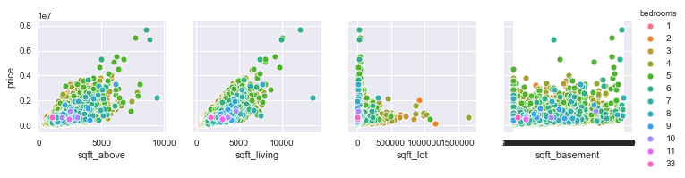


```python
#checking to see which house is the most common(bedroom wise)
data['bedrooms'].value_counts().plot(kind='bar')
plt.title('Number of Bedrooms')
plt.xlabel('Bedrooms')
plt.ylabel('Count')
sns.despine
```


    <function seaborn.utils.despine(fig=None, ax=None, top=True, right=True, left=False, bottom=False, offset=None, trim=False)>


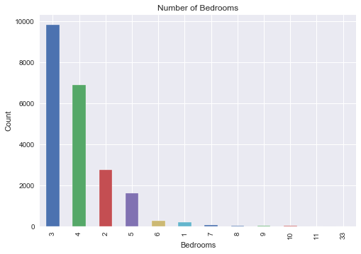


```python
#Visualizing the data
sns.pairplot(data, 
             x_vars=["lat", "long", "bathrooms", "grade"], 
             y_vars=["price"],
             hue = "view")
             
```


    <seaborn.axisgrid.PairGrid at 0x1c5cc8517f0>


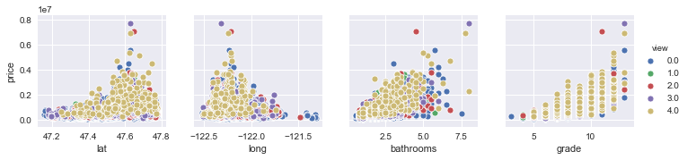


```python
# Using violin plot to plot View feature
sns.violinplot(data=df, x = 'view', y = 'price')
```


    <matplotlib.axes._subplots.AxesSubplot at 0x1c5d78722b0>


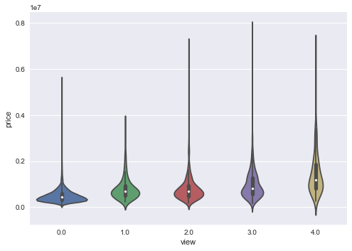


```python
# Using violin plot to plot floors feature
sns.violinplot(data=df, x = 'floors', y = 'price')
```


    <matplotlib.axes._subplots.AxesSubplot at 0x1c5d868c2b0>


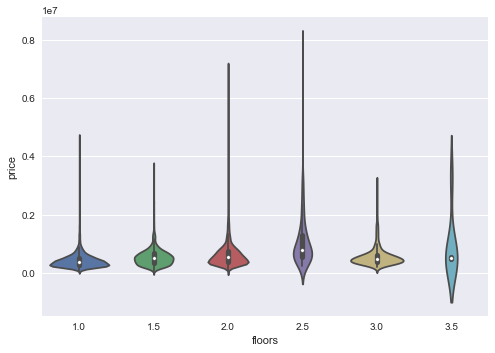


```python
# Using violin plot to plot waterfront feature
sns.violinplot(data=df, x = 'waterfront', y = 'price')
```


    <matplotlib.axes._subplots.AxesSubplot at 0x1c5d788a9b0>


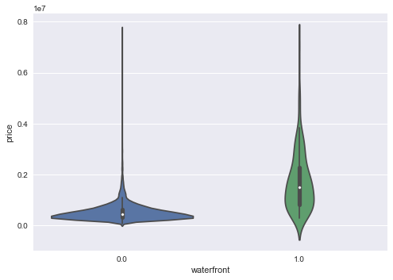


```python
#checking the shape of the dataset
data.shape
```


    (21597, 19)


```python
#finding Null values
data.isna().any()
```


    price            False
    bedrooms         False
    bathrooms        False
    sqft_living      False
    sqft_lot         False
    floors           False
    waterfront        True
    view              True
    condition        False
    grade            False
    sqft_above       False
    sqft_basement    False
    yr_built         False
    yr_renovated      True
    zipcode          False
    lat              False
    long             False
    sqft_living15    False
    sqft_lot15       False
    dtype: bool


```python
#Number of NaNs the in KC house dataset by column
data.isna().sum()
```


    price               0
    bedrooms            0
    bathrooms           0
    sqft_living         0
    sqft_lot            0
    floors              0
    waterfront       2376
    view               63
    condition           0
    grade               0
    sqft_above          0
    sqft_basement       0
    yr_built            0
    yr_renovated     3842
    zipcode             0
    lat                 0
    long                0
    sqft_living15       0
    sqft_lot15          0
    dtype: int64


```python
# find duplicates
duplicates = data[data.duplicated()]
print(len(duplicates))
```

    4
    


```python
# dropping duplicate values 
data.drop_duplicates(keep='first',inplace=True) 
```


```python
#check for duplicates
duplicates = data[data.duplicated()]
print(len(duplicates))
```

    0
    


```python
# checking for missing values with placeholders
for col in data.columns:
    print(col, '\n', df[col].value_counts(normalize=True).head(10), '\n\n')
```

    price 
     350000.0    0.007964
    450000.0    0.007964
    550000.0    0.007362
    500000.0    0.007038
    425000.0    0.006945
    325000.0    0.006853
    400000.0    0.006714
    375000.0    0.006390
    300000.0    0.006158
    525000.0    0.006066
    Name: price, dtype: float64 
    
    
    bedrooms 
     3     0.454878
    4     0.318655
    2     0.127796
    5     0.074131
    6     0.012594
    1     0.009075
    7     0.001760
    8     0.000602
    9     0.000278
    10    0.000139
    Name: bedrooms, dtype: float64 
    
    
    bathrooms 
     2.50    0.248970
    1.00    0.178312
    1.75    0.141131
    2.25    0.094782
    2.00    0.089364
    1.50    0.066907
    2.75    0.054869
    3.00    0.034866
    3.50    0.033847
    3.25    0.027272
    Name: bathrooms, dtype: float64 
    
    
    sqft_living 
     1300    0.006390
    1400    0.006251
    1440    0.006158
    1660    0.005973
    1010    0.005973
    1800    0.005973
    1820    0.005927
    1480    0.005788
    1720    0.005788
    1540    0.005742
    Name: sqft_living, dtype: float64 
    
    
    sqft_lot 
     5000    0.016576
    6000    0.013428
    4000    0.011622
    7200    0.010187
    7500    0.005510
    4800    0.005510
    4500    0.005279
    8400    0.005140
    9600    0.005047
    3600    0.004769
    Name: sqft_lot, dtype: float64 
    
    
    floors 
     1.0    0.494189
    2.0    0.381303
    1.5    0.088438
    3.0    0.028291
    2.5    0.007455
    3.5    0.000324
    Name: floors, dtype: float64 
    
    
    waterfront 
     0.0    0.992404
    1.0    0.007596
    Name: waterfront, dtype: float64 
    
    
    view 
     0.0    0.901923
    2.0    0.044441
    3.0    0.023591
    1.0    0.015325
    4.0    0.014721
    Name: view, dtype: float64 
    
    
    condition 
     3    0.649164
    4    0.262861
    5    0.078761
    2    0.007871
    1    0.001343
    Name: condition, dtype: float64 
    
    
    grade 
     7     0.415521
    8     0.280826
    9     0.121082
    6     0.094365
    10    0.052507
    11    0.018475
    5     0.011205
    12    0.004121
    4     0.001250
    13    0.000602
    Name: grade, dtype: float64 
    
    
    sqft_above 
     1300    0.009816
    1010    0.009724
    1200    0.009538
    1220    0.008890
    1140    0.008520
    1400    0.008334
    1060    0.008242
    1180    0.008196
    1340    0.008149
    1250    0.008057
    Name: sqft_above, dtype: float64 
    
    
    sqft_basement 
     0.0       0.593879
    ?         0.021021
    600.0     0.010048
    500.0     0.009677
    700.0     0.009631
    800.0     0.009307
    400.0     0.008520
    1000.0    0.006853
    300.0     0.006575
    900.0     0.006575
    Name: sqft_basement, dtype: float64 
    
    
    yr_built 
     2014    0.025883
    2006    0.020975
    2005    0.020836
    2004    0.020049
    2003    0.019447
    2007    0.019308
    1977    0.019308
    1978    0.017919
    1968    0.017641
    2008    0.016993
    Name: yr_built, dtype: float64 
    
    
    yr_renovated 
     0.0       0.958096
    2014.0    0.004112
    2003.0    0.001746
    2013.0    0.001746
    2007.0    0.001690
    2000.0    0.001633
    2005.0    0.001633
    1990.0    0.001239
    2004.0    0.001239
    2009.0    0.001183
    Name: yr_renovated, dtype: float64 
    
    
    zipcode 
     98103    0.027874
    98038    0.027272
    98115    0.026994
    98052    0.026578
    98117    0.025605
    98042    0.025328
    98034    0.025235
    98118    0.023475
    98023    0.023105
    98006    0.023059
    Name: zipcode, dtype: float64 
    
    
    lat 
     47.6624    0.000787
    47.5491    0.000787
    47.5322    0.000787
    47.6846    0.000787
    47.6711    0.000741
    47.6886    0.000741
    47.6955    0.000741
    47.6647    0.000695
    47.6904    0.000695
    47.6860    0.000695
    Name: lat, dtype: float64 
    
    
    long 
     -122.290    0.005325
    -122.300    0.005140
    -122.362    0.004815
    -122.291    0.004630
    -122.372    0.004584
    -122.363    0.004584
    -122.288    0.004538
    -122.357    0.004445
    -122.284    0.004399
    -122.172    0.004352
    Name: long, dtype: float64 
    
    
    sqft_living15 
     1540    0.009122
    1440    0.009029
    1560    0.008890
    1500    0.008334
    1460    0.007825
    1580    0.007733
    1610    0.007686
    1800    0.007686
    1720    0.007686
    1620    0.007594
    Name: sqft_living15, dtype: float64 
    
    
    sqft_lot15 
     5000    0.019771
    4000    0.016484
    6000    0.013335
    7200    0.009724
    4800    0.006714
    7500    0.006575
    8400    0.005371
    4500    0.005140
    3600    0.005140
    5100    0.005047
    Name: sqft_lot15, dtype: float64 
    
    
    

sqft_basement has a ? for roughly 2% 


```python
# replace ? with nan
data.replace(['?',], np.nan, inplace=True)
```


```python
#checking to make sure ? is replaced with nan
for col in data.columns:
    print(col, '\n', data[col].value_counts(normalize=True).head(10), '\n\n')
```

    price 
     450000.0    0.007966
    350000.0    0.007966
    550000.0    0.007363
    500000.0    0.007039
    425000.0    0.006947
    325000.0    0.006854
    400000.0    0.006715
    375000.0    0.006391
    300000.0    0.006159
    525000.0    0.006067
    Name: price, dtype: float64 
    
    
    bedrooms 
     3     0.454823
    4     0.318714
    2     0.127773
    5     0.074144
    6     0.012597
    1     0.009077
    7     0.001760
    8     0.000602
    9     0.000278
    10    0.000139
    Name: bedrooms, dtype: float64 
    
    
    bathrooms 
     2.50    0.248923
    1.00    0.178345
    1.75    0.141157
    2.25    0.094753
    2.00    0.089335
    1.50    0.066920
    2.75    0.054879
    3.00    0.034872
    3.50    0.033854
    3.25    0.027277
    Name: bathrooms, dtype: float64 
    
    
    sqft_living 
     1300    0.006391
    1400    0.006252
    1440    0.006159
    1660    0.005974
    1010    0.005974
    1800    0.005974
    1820    0.005928
    1480    0.005789
    1720    0.005789
    1540    0.005743
    Name: sqft_living, dtype: float64 
    
    
    sqft_lot 
     5000    0.016579
    6000    0.013430
    4000    0.011624
    7200    0.010188
    4800    0.005511
    7500    0.005511
    4500    0.005279
    8400    0.005141
    9600    0.005048
    3600    0.004770
    Name: sqft_lot, dtype: float64 
    
    
    floors 
     1.0    0.494281
    2.0    0.381235
    1.5    0.088455
    3.0    0.028250
    2.5    0.007456
    3.5    0.000324
    Name: floors, dtype: float64 
    
    
    waterfront 
     0.0    0.992403
    1.0    0.007597
    Name: waterfront, dtype: float64 
    
    
    view 
     0.0    0.901904
    2.0    0.044450
    3.0    0.023595
    1.0    0.015327
    4.0    0.014724
    Name: view, dtype: float64 
    
    
    condition 
     3    0.649099
    4    0.262909
    5    0.078776
    2    0.007873
    1    0.001343
    Name: condition, dtype: float64 
    
    
    grade 
     7     0.415598
    8     0.280832
    9     0.120965
    6     0.094382
    10    0.052517
    11    0.018478
    5     0.011207
    12    0.004122
    4     0.001250
    13    0.000602
    Name: grade, dtype: float64 
    
    
    sqft_above 
     1300    0.009818
    1010    0.009725
    1200    0.009540
    1220    0.008892
    1140    0.008521
    1400    0.008336
    1060    0.008243
    1180    0.008197
    1340    0.008151
    1250    0.008058
    Name: sqft_above, dtype: float64 
    
    
    sqft_basement 
     0.0       0.606604
    600.0     0.010265
    500.0     0.009887
    700.0     0.009840
    800.0     0.009508
    400.0     0.008704
    1000.0    0.007001
    300.0     0.006717
    900.0     0.006717
    200.0     0.004967
    Name: sqft_basement, dtype: float64 
    
    
    yr_built 
     2014    0.025842
    2006    0.020979
    2005    0.020840
    2004    0.020053
    2003    0.019451
    2007    0.019312
    1977    0.019312
    1978    0.017922
    1968    0.017645
    2008    0.016950
    Name: yr_built, dtype: float64 
    
    
    yr_renovated 
     0.0       0.958087
    2014.0    0.004112
    2003.0    0.001746
    2013.0    0.001746
    2007.0    0.001690
    2000.0    0.001634
    2005.0    0.001634
    1990.0    0.001239
    2004.0    0.001239
    2009.0    0.001183
    Name: yr_renovated, dtype: float64 
    
    
    zipcode 
     98103    0.027879
    98038    0.027277
    98115    0.026999
    98052    0.026583
    98117    0.025610
    98042    0.025332
    98034    0.025240
    98118    0.023480
    98023    0.023109
    98006    0.023017
    Name: zipcode, dtype: float64 
    
    
    lat 
     47.6624    0.000787
    47.5491    0.000787
    47.5322    0.000787
    47.6846    0.000787
    47.6711    0.000741
    47.6886    0.000741
    47.6955    0.000741
    47.6647    0.000695
    47.6904    0.000695
    47.6860    0.000695
    Name: lat, dtype: float64 
    
    
    long 
     -122.290    0.005326
    -122.300    0.005141
    -122.362    0.004816
    -122.291    0.004631
    -122.372    0.004585
    -122.363    0.004585
    -122.288    0.004539
    -122.357    0.004400
    -122.284    0.004400
    -122.365    0.004353
    Name: long, dtype: float64 
    
    
    sqft_living15 
     1540    0.009123
    1440    0.009031
    1560    0.008892
    1500    0.008336
    1460    0.007827
    1580    0.007734
    1610    0.007688
    1800    0.007688
    1720    0.007688
    1620    0.007595
    Name: sqft_living15, dtype: float64 
    
    
    sqft_lot15 
     5000    0.019775
    4000    0.016487
    6000    0.013338
    7200    0.009725
    4800    0.006715
    7500    0.006576
    8400    0.005372
    3600    0.005141
    4500    0.005141
    5100    0.005048
    Name: sqft_lot15, dtype: float64 
    
    
    


```python
df = data.drop(['waterfront', 'view', 'yr_renovated'], axis=1)
df.head()
```


<div>
<style scoped>
    .dataframe tbody tr th:only-of-type {
        vertical-align: middle;
    }

    .dataframe tbody tr th {
        vertical-align: top;
    }

    .dataframe thead th {
        text-align: right;
    }
</style>
<table border="1" class="dataframe">
  <thead>
    <tr style="text-align: right;">
      <th></th>
      <th>price</th>
      <th>bedrooms</th>
      <th>bathrooms</th>
      <th>sqft_living</th>
      <th>sqft_lot</th>
      <th>floors</th>
      <th>condition</th>
      <th>grade</th>
      <th>sqft_above</th>
      <th>sqft_basement</th>
      <th>yr_built</th>
      <th>zipcode</th>
      <th>lat</th>
      <th>long</th>
      <th>sqft_living15</th>
      <th>sqft_lot15</th>
    </tr>
  </thead>
  <tbody>
    <tr>
      <th>0</th>
      <td>221900.0</td>
      <td>3</td>
      <td>1.00</td>
      <td>1180</td>
      <td>5650</td>
      <td>1.0</td>
      <td>3</td>
      <td>7</td>
      <td>1180</td>
      <td>0.0</td>
      <td>1955</td>
      <td>98178</td>
      <td>47.5112</td>
      <td>-122.257</td>
      <td>1340</td>
      <td>5650</td>
    </tr>
    <tr>
      <th>1</th>
      <td>538000.0</td>
      <td>3</td>
      <td>2.25</td>
      <td>2570</td>
      <td>7242</td>
      <td>2.0</td>
      <td>3</td>
      <td>7</td>
      <td>2170</td>
      <td>400.0</td>
      <td>1951</td>
      <td>98125</td>
      <td>47.7210</td>
      <td>-122.319</td>
      <td>1690</td>
      <td>7639</td>
    </tr>
    <tr>
      <th>2</th>
      <td>180000.0</td>
      <td>2</td>
      <td>1.00</td>
      <td>770</td>
      <td>10000</td>
      <td>1.0</td>
      <td>3</td>
      <td>6</td>
      <td>770</td>
      <td>0.0</td>
      <td>1933</td>
      <td>98028</td>
      <td>47.7379</td>
      <td>-122.233</td>
      <td>2720</td>
      <td>8062</td>
    </tr>
    <tr>
      <th>3</th>
      <td>604000.0</td>
      <td>4</td>
      <td>3.00</td>
      <td>1960</td>
      <td>5000</td>
      <td>1.0</td>
      <td>5</td>
      <td>7</td>
      <td>1050</td>
      <td>910.0</td>
      <td>1965</td>
      <td>98136</td>
      <td>47.5208</td>
      <td>-122.393</td>
      <td>1360</td>
      <td>5000</td>
    </tr>
    <tr>
      <th>4</th>
      <td>510000.0</td>
      <td>3</td>
      <td>2.00</td>
      <td>1680</td>
      <td>8080</td>
      <td>1.0</td>
      <td>3</td>
      <td>8</td>
      <td>1680</td>
      <td>0.0</td>
      <td>1987</td>
      <td>98074</td>
      <td>47.6168</td>
      <td>-122.045</td>
      <td>1800</td>
      <td>7503</td>
    </tr>
  </tbody>
</table>
</div>


```python
# Dropping Rows That Contain Null Values and checking for null values
data = df.dropna()
data.isna().sum()
```


    price            0
    bedrooms         0
    bathrooms        0
    sqft_living      0
    sqft_lot         0
    floors           0
    condition        0
    grade            0
    sqft_above       0
    sqft_basement    0
    yr_built         0
    zipcode          0
    lat              0
    long             0
    sqft_living15    0
    sqft_lot15       0
    dtype: int64


```python
#checking the shape of my data
data.shape
```


    (21139, 16)


```python
#checking the data
data.head(10)
```


<div>
<style scoped>
    .dataframe tbody tr th:only-of-type {
        vertical-align: middle;
    }

    .dataframe tbody tr th {
        vertical-align: top;
    }

    .dataframe thead th {
        text-align: right;
    }
</style>
<table border="1" class="dataframe">
  <thead>
    <tr style="text-align: right;">
      <th></th>
      <th>price</th>
      <th>bedrooms</th>
      <th>bathrooms</th>
      <th>sqft_living</th>
      <th>sqft_lot</th>
      <th>floors</th>
      <th>condition</th>
      <th>grade</th>
      <th>sqft_above</th>
      <th>sqft_basement</th>
      <th>yr_built</th>
      <th>zipcode</th>
      <th>lat</th>
      <th>long</th>
      <th>sqft_living15</th>
      <th>sqft_lot15</th>
    </tr>
  </thead>
  <tbody>
    <tr>
      <th>0</th>
      <td>221900.0</td>
      <td>3</td>
      <td>1.00</td>
      <td>1180</td>
      <td>5650</td>
      <td>1.0</td>
      <td>3</td>
      <td>7</td>
      <td>1180</td>
      <td>0.0</td>
      <td>1955</td>
      <td>98178</td>
      <td>47.5112</td>
      <td>-122.257</td>
      <td>1340</td>
      <td>5650</td>
    </tr>
    <tr>
      <th>1</th>
      <td>538000.0</td>
      <td>3</td>
      <td>2.25</td>
      <td>2570</td>
      <td>7242</td>
      <td>2.0</td>
      <td>3</td>
      <td>7</td>
      <td>2170</td>
      <td>400.0</td>
      <td>1951</td>
      <td>98125</td>
      <td>47.7210</td>
      <td>-122.319</td>
      <td>1690</td>
      <td>7639</td>
    </tr>
    <tr>
      <th>2</th>
      <td>180000.0</td>
      <td>2</td>
      <td>1.00</td>
      <td>770</td>
      <td>10000</td>
      <td>1.0</td>
      <td>3</td>
      <td>6</td>
      <td>770</td>
      <td>0.0</td>
      <td>1933</td>
      <td>98028</td>
      <td>47.7379</td>
      <td>-122.233</td>
      <td>2720</td>
      <td>8062</td>
    </tr>
    <tr>
      <th>3</th>
      <td>604000.0</td>
      <td>4</td>
      <td>3.00</td>
      <td>1960</td>
      <td>5000</td>
      <td>1.0</td>
      <td>5</td>
      <td>7</td>
      <td>1050</td>
      <td>910.0</td>
      <td>1965</td>
      <td>98136</td>
      <td>47.5208</td>
      <td>-122.393</td>
      <td>1360</td>
      <td>5000</td>
    </tr>
    <tr>
      <th>4</th>
      <td>510000.0</td>
      <td>3</td>
      <td>2.00</td>
      <td>1680</td>
      <td>8080</td>
      <td>1.0</td>
      <td>3</td>
      <td>8</td>
      <td>1680</td>
      <td>0.0</td>
      <td>1987</td>
      <td>98074</td>
      <td>47.6168</td>
      <td>-122.045</td>
      <td>1800</td>
      <td>7503</td>
    </tr>
    <tr>
      <th>5</th>
      <td>1230000.0</td>
      <td>4</td>
      <td>4.50</td>
      <td>5420</td>
      <td>101930</td>
      <td>1.0</td>
      <td>3</td>
      <td>11</td>
      <td>3890</td>
      <td>1530.0</td>
      <td>2001</td>
      <td>98053</td>
      <td>47.6561</td>
      <td>-122.005</td>
      <td>4760</td>
      <td>101930</td>
    </tr>
    <tr>
      <th>7</th>
      <td>291850.0</td>
      <td>3</td>
      <td>1.50</td>
      <td>1060</td>
      <td>9711</td>
      <td>1.0</td>
      <td>3</td>
      <td>7</td>
      <td>1060</td>
      <td>0.0</td>
      <td>1963</td>
      <td>98198</td>
      <td>47.4095</td>
      <td>-122.315</td>
      <td>1650</td>
      <td>9711</td>
    </tr>
    <tr>
      <th>8</th>
      <td>229500.0</td>
      <td>3</td>
      <td>1.00</td>
      <td>1780</td>
      <td>7470</td>
      <td>1.0</td>
      <td>3</td>
      <td>7</td>
      <td>1050</td>
      <td>730.0</td>
      <td>1960</td>
      <td>98146</td>
      <td>47.5123</td>
      <td>-122.337</td>
      <td>1780</td>
      <td>8113</td>
    </tr>
    <tr>
      <th>9</th>
      <td>323000.0</td>
      <td>3</td>
      <td>2.50</td>
      <td>1890</td>
      <td>6560</td>
      <td>2.0</td>
      <td>3</td>
      <td>7</td>
      <td>1890</td>
      <td>0.0</td>
      <td>2003</td>
      <td>98038</td>
      <td>47.3684</td>
      <td>-122.031</td>
      <td>2390</td>
      <td>7570</td>
    </tr>
    <tr>
      <th>10</th>
      <td>662500.0</td>
      <td>3</td>
      <td>2.50</td>
      <td>3560</td>
      <td>9796</td>
      <td>1.0</td>
      <td>3</td>
      <td>8</td>
      <td>1860</td>
      <td>1700.0</td>
      <td>1965</td>
      <td>98007</td>
      <td>47.6007</td>
      <td>-122.145</td>
      <td>2210</td>
      <td>8925</td>
    </tr>
  </tbody>
</table>
</div>


### multicollinearity check


```python
#checking for multicolinearity of features
data.corr()
```


<div>
<style scoped>
    .dataframe tbody tr th:only-of-type {
        vertical-align: middle;
    }

    .dataframe tbody tr th {
        vertical-align: top;
    }

    .dataframe thead th {
        text-align: right;
    }
</style>
<table border="1" class="dataframe">
  <thead>
    <tr style="text-align: right;">
      <th></th>
      <th>price</th>
      <th>bedrooms</th>
      <th>bathrooms</th>
      <th>sqft_living</th>
      <th>sqft_lot</th>
      <th>floors</th>
      <th>condition</th>
      <th>grade</th>
      <th>sqft_above</th>
      <th>yr_built</th>
      <th>zipcode</th>
      <th>lat</th>
      <th>long</th>
      <th>sqft_living15</th>
      <th>sqft_lot15</th>
    </tr>
  </thead>
  <tbody>
    <tr>
      <th>price</th>
      <td>1.000000</td>
      <td>0.309177</td>
      <td>0.525894</td>
      <td>0.702326</td>
      <td>0.087927</td>
      <td>0.256452</td>
      <td>0.035273</td>
      <td>0.667846</td>
      <td>0.605133</td>
      <td>0.054508</td>
      <td>-0.053142</td>
      <td>0.306503</td>
      <td>0.022061</td>
      <td>0.586407</td>
      <td>0.083180</td>
    </tr>
    <tr>
      <th>bedrooms</th>
      <td>0.309177</td>
      <td>1.000000</td>
      <td>0.513892</td>
      <td>0.577970</td>
      <td>0.032223</td>
      <td>0.179255</td>
      <td>0.025632</td>
      <td>0.357068</td>
      <td>0.479182</td>
      <td>0.157212</td>
      <td>-0.152643</td>
      <td>-0.009540</td>
      <td>0.131038</td>
      <td>0.392422</td>
      <td>0.030433</td>
    </tr>
    <tr>
      <th>bathrooms</th>
      <td>0.525894</td>
      <td>0.513892</td>
      <td>1.000000</td>
      <td>0.755316</td>
      <td>0.087899</td>
      <td>0.504141</td>
      <td>-0.127991</td>
      <td>0.666530</td>
      <td>0.686478</td>
      <td>0.508435</td>
      <td>-0.204273</td>
      <td>0.024993</td>
      <td>0.224478</td>
      <td>0.570159</td>
      <td>0.088849</td>
    </tr>
    <tr>
      <th>sqft_living</th>
      <td>0.702326</td>
      <td>0.577970</td>
      <td>0.755316</td>
      <td>1.000000</td>
      <td>0.172920</td>
      <td>0.354933</td>
      <td>-0.061352</td>
      <td>0.763295</td>
      <td>0.876675</td>
      <td>0.319638</td>
      <td>-0.198871</td>
      <td>0.052981</td>
      <td>0.240732</td>
      <td>0.756366</td>
      <td>0.184438</td>
    </tr>
    <tr>
      <th>sqft_lot</th>
      <td>0.087927</td>
      <td>0.032223</td>
      <td>0.087899</td>
      <td>0.172920</td>
      <td>1.000000</td>
      <td>-0.007439</td>
      <td>-0.009707</td>
      <td>0.113468</td>
      <td>0.183453</td>
      <td>0.052851</td>
      <td>-0.129375</td>
      <td>-0.085461</td>
      <td>0.230582</td>
      <td>0.143407</td>
      <td>0.720644</td>
    </tr>
    <tr>
      <th>floors</th>
      <td>0.256452</td>
      <td>0.179255</td>
      <td>0.504141</td>
      <td>0.354933</td>
      <td>-0.007439</td>
      <td>1.000000</td>
      <td>-0.264188</td>
      <td>0.459105</td>
      <td>0.524466</td>
      <td>0.489508</td>
      <td>-0.059011</td>
      <td>0.048985</td>
      <td>0.126134</td>
      <td>0.280519</td>
      <td>-0.011450</td>
    </tr>
    <tr>
      <th>condition</th>
      <td>0.035273</td>
      <td>0.025632</td>
      <td>-0.127991</td>
      <td>-0.061352</td>
      <td>-0.009707</td>
      <td>-0.264188</td>
      <td>1.000000</td>
      <td>-0.148417</td>
      <td>-0.159332</td>
      <td>-0.362026</td>
      <td>0.003406</td>
      <td>-0.015599</td>
      <td>-0.106334</td>
      <td>-0.093554</td>
      <td>-0.004901</td>
    </tr>
    <tr>
      <th>grade</th>
      <td>0.667846</td>
      <td>0.357068</td>
      <td>0.666530</td>
      <td>0.763295</td>
      <td>0.113468</td>
      <td>0.459105</td>
      <td>-0.148417</td>
      <td>1.000000</td>
      <td>0.756554</td>
      <td>0.448010</td>
      <td>-0.185145</td>
      <td>0.113403</td>
      <td>0.199323</td>
      <td>0.713772</td>
      <td>0.121995</td>
    </tr>
    <tr>
      <th>sqft_above</th>
      <td>0.605133</td>
      <td>0.479182</td>
      <td>0.686478</td>
      <td>0.876675</td>
      <td>0.183453</td>
      <td>0.524466</td>
      <td>-0.159332</td>
      <td>0.756554</td>
      <td>1.000000</td>
      <td>0.425336</td>
      <td>-0.260755</td>
      <td>-0.000357</td>
      <td>0.344484</td>
      <td>0.730990</td>
      <td>0.195623</td>
    </tr>
    <tr>
      <th>yr_built</th>
      <td>0.054508</td>
      <td>0.157212</td>
      <td>0.508435</td>
      <td>0.319638</td>
      <td>0.052851</td>
      <td>0.489508</td>
      <td>-0.362026</td>
      <td>0.448010</td>
      <td>0.425336</td>
      <td>1.000000</td>
      <td>-0.347360</td>
      <td>-0.148739</td>
      <td>0.409501</td>
      <td>0.325632</td>
      <td>0.071505</td>
    </tr>
    <tr>
      <th>zipcode</th>
      <td>-0.053142</td>
      <td>-0.152643</td>
      <td>-0.204273</td>
      <td>-0.198871</td>
      <td>-0.129375</td>
      <td>-0.059011</td>
      <td>0.003406</td>
      <td>-0.185145</td>
      <td>-0.260755</td>
      <td>-0.347360</td>
      <td>1.000000</td>
      <td>0.267089</td>
      <td>-0.564060</td>
      <td>-0.277968</td>
      <td>-0.146725</td>
    </tr>
    <tr>
      <th>lat</th>
      <td>0.306503</td>
      <td>-0.009540</td>
      <td>0.024993</td>
      <td>0.052981</td>
      <td>-0.085461</td>
      <td>0.048985</td>
      <td>-0.015599</td>
      <td>0.113403</td>
      <td>-0.000357</td>
      <td>-0.148739</td>
      <td>0.267089</td>
      <td>1.000000</td>
      <td>-0.135199</td>
      <td>0.050434</td>
      <td>-0.084988</td>
    </tr>
    <tr>
      <th>long</th>
      <td>0.022061</td>
      <td>0.131038</td>
      <td>0.224478</td>
      <td>0.240732</td>
      <td>0.230582</td>
      <td>0.126134</td>
      <td>-0.106334</td>
      <td>0.199323</td>
      <td>0.344484</td>
      <td>0.409501</td>
      <td>-0.564060</td>
      <td>-0.135199</td>
      <td>1.000000</td>
      <td>0.334210</td>
      <td>0.255552</td>
    </tr>
    <tr>
      <th>sqft_living15</th>
      <td>0.586407</td>
      <td>0.392422</td>
      <td>0.570159</td>
      <td>0.756366</td>
      <td>0.143407</td>
      <td>0.280519</td>
      <td>-0.093554</td>
      <td>0.713772</td>
      <td>0.730990</td>
      <td>0.325632</td>
      <td>-0.277968</td>
      <td>0.050434</td>
      <td>0.334210</td>
      <td>1.000000</td>
      <td>0.183062</td>
    </tr>
    <tr>
      <th>sqft_lot15</th>
      <td>0.083180</td>
      <td>0.030433</td>
      <td>0.088849</td>
      <td>0.184438</td>
      <td>0.720644</td>
      <td>-0.011450</td>
      <td>-0.004901</td>
      <td>0.121995</td>
      <td>0.195623</td>
      <td>0.071505</td>
      <td>-0.146725</td>
      <td>-0.084988</td>
      <td>0.255552</td>
      <td>0.183062</td>
      <td>1.000000</td>
    </tr>
  </tbody>
</table>
</div>


```python
# checking for correlation greater than .75
abs(data.corr()) > 0.75
```


<div>
<style scoped>
    .dataframe tbody tr th:only-of-type {
        vertical-align: middle;
    }

    .dataframe tbody tr th {
        vertical-align: top;
    }

    .dataframe thead th {
        text-align: right;
    }
</style>
<table border="1" class="dataframe">
  <thead>
    <tr style="text-align: right;">
      <th></th>
      <th>price</th>
      <th>bedrooms</th>
      <th>bathrooms</th>
      <th>sqft_living</th>
      <th>sqft_lot</th>
      <th>floors</th>
      <th>condition</th>
      <th>grade</th>
      <th>sqft_above</th>
      <th>yr_built</th>
      <th>zipcode</th>
      <th>lat</th>
      <th>long</th>
      <th>sqft_living15</th>
      <th>sqft_lot15</th>
    </tr>
  </thead>
  <tbody>
    <tr>
      <th>price</th>
      <td>True</td>
      <td>False</td>
      <td>False</td>
      <td>False</td>
      <td>False</td>
      <td>False</td>
      <td>False</td>
      <td>False</td>
      <td>False</td>
      <td>False</td>
      <td>False</td>
      <td>False</td>
      <td>False</td>
      <td>False</td>
      <td>False</td>
    </tr>
    <tr>
      <th>bedrooms</th>
      <td>False</td>
      <td>True</td>
      <td>False</td>
      <td>False</td>
      <td>False</td>
      <td>False</td>
      <td>False</td>
      <td>False</td>
      <td>False</td>
      <td>False</td>
      <td>False</td>
      <td>False</td>
      <td>False</td>
      <td>False</td>
      <td>False</td>
    </tr>
    <tr>
      <th>bathrooms</th>
      <td>False</td>
      <td>False</td>
      <td>True</td>
      <td>True</td>
      <td>False</td>
      <td>False</td>
      <td>False</td>
      <td>False</td>
      <td>False</td>
      <td>False</td>
      <td>False</td>
      <td>False</td>
      <td>False</td>
      <td>False</td>
      <td>False</td>
    </tr>
    <tr>
      <th>sqft_living</th>
      <td>False</td>
      <td>False</td>
      <td>True</td>
      <td>True</td>
      <td>False</td>
      <td>False</td>
      <td>False</td>
      <td>True</td>
      <td>True</td>
      <td>False</td>
      <td>False</td>
      <td>False</td>
      <td>False</td>
      <td>True</td>
      <td>False</td>
    </tr>
    <tr>
      <th>sqft_lot</th>
      <td>False</td>
      <td>False</td>
      <td>False</td>
      <td>False</td>
      <td>True</td>
      <td>False</td>
      <td>False</td>
      <td>False</td>
      <td>False</td>
      <td>False</td>
      <td>False</td>
      <td>False</td>
      <td>False</td>
      <td>False</td>
      <td>False</td>
    </tr>
    <tr>
      <th>floors</th>
      <td>False</td>
      <td>False</td>
      <td>False</td>
      <td>False</td>
      <td>False</td>
      <td>True</td>
      <td>False</td>
      <td>False</td>
      <td>False</td>
      <td>False</td>
      <td>False</td>
      <td>False</td>
      <td>False</td>
      <td>False</td>
      <td>False</td>
    </tr>
    <tr>
      <th>condition</th>
      <td>False</td>
      <td>False</td>
      <td>False</td>
      <td>False</td>
      <td>False</td>
      <td>False</td>
      <td>True</td>
      <td>False</td>
      <td>False</td>
      <td>False</td>
      <td>False</td>
      <td>False</td>
      <td>False</td>
      <td>False</td>
      <td>False</td>
    </tr>
    <tr>
      <th>grade</th>
      <td>False</td>
      <td>False</td>
      <td>False</td>
      <td>True</td>
      <td>False</td>
      <td>False</td>
      <td>False</td>
      <td>True</td>
      <td>True</td>
      <td>False</td>
      <td>False</td>
      <td>False</td>
      <td>False</td>
      <td>False</td>
      <td>False</td>
    </tr>
    <tr>
      <th>sqft_above</th>
      <td>False</td>
      <td>False</td>
      <td>False</td>
      <td>True</td>
      <td>False</td>
      <td>False</td>
      <td>False</td>
      <td>True</td>
      <td>True</td>
      <td>False</td>
      <td>False</td>
      <td>False</td>
      <td>False</td>
      <td>False</td>
      <td>False</td>
    </tr>
    <tr>
      <th>yr_built</th>
      <td>False</td>
      <td>False</td>
      <td>False</td>
      <td>False</td>
      <td>False</td>
      <td>False</td>
      <td>False</td>
      <td>False</td>
      <td>False</td>
      <td>True</td>
      <td>False</td>
      <td>False</td>
      <td>False</td>
      <td>False</td>
      <td>False</td>
    </tr>
    <tr>
      <th>zipcode</th>
      <td>False</td>
      <td>False</td>
      <td>False</td>
      <td>False</td>
      <td>False</td>
      <td>False</td>
      <td>False</td>
      <td>False</td>
      <td>False</td>
      <td>False</td>
      <td>True</td>
      <td>False</td>
      <td>False</td>
      <td>False</td>
      <td>False</td>
    </tr>
    <tr>
      <th>lat</th>
      <td>False</td>
      <td>False</td>
      <td>False</td>
      <td>False</td>
      <td>False</td>
      <td>False</td>
      <td>False</td>
      <td>False</td>
      <td>False</td>
      <td>False</td>
      <td>False</td>
      <td>True</td>
      <td>False</td>
      <td>False</td>
      <td>False</td>
    </tr>
    <tr>
      <th>long</th>
      <td>False</td>
      <td>False</td>
      <td>False</td>
      <td>False</td>
      <td>False</td>
      <td>False</td>
      <td>False</td>
      <td>False</td>
      <td>False</td>
      <td>False</td>
      <td>False</td>
      <td>False</td>
      <td>True</td>
      <td>False</td>
      <td>False</td>
    </tr>
    <tr>
      <th>sqft_living15</th>
      <td>False</td>
      <td>False</td>
      <td>False</td>
      <td>True</td>
      <td>False</td>
      <td>False</td>
      <td>False</td>
      <td>False</td>
      <td>False</td>
      <td>False</td>
      <td>False</td>
      <td>False</td>
      <td>False</td>
      <td>True</td>
      <td>False</td>
    </tr>
    <tr>
      <th>sqft_lot15</th>
      <td>False</td>
      <td>False</td>
      <td>False</td>
      <td>False</td>
      <td>False</td>
      <td>False</td>
      <td>False</td>
      <td>False</td>
      <td>False</td>
      <td>False</td>
      <td>False</td>
      <td>False</td>
      <td>False</td>
      <td>False</td>
      <td>True</td>
    </tr>
  </tbody>
</table>
</div>


```python
# Generating Heatmap
corrmat = data.corr()
k = 18 #number of variables for heatmap
cols = corrmat.nlargest(k, 'price')['price'].index
cm = np.corrcoef(data[cols].values.T)
sns.set(font_scale=1.25)
f, ax = plt.subplots(figsize=(12, 9))
hm = sns.heatmap(cm, cbar=True, annot=True, square=True, fmt='.2f', annot_kws={'size': 10}, yticklabels=cols.values, xticklabels=cols.values)
plt.show()
```


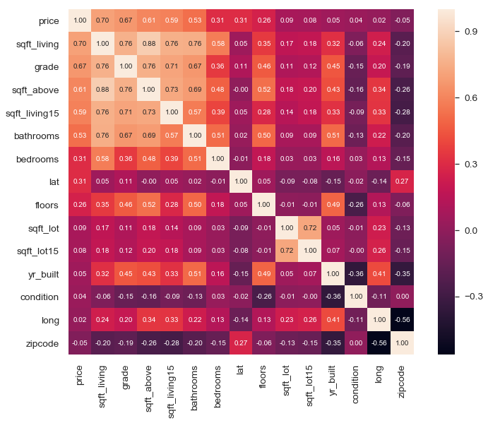


 after looking at heat map i removed sqft-living also removed lat, long, zipcode, sqft_basement since i dont plan to use them.


```python
#dropping sqft_living due to high correlation, and lat, long, zipcode, sqft_basement
data = data.drop(['sqft_living', 'lat', 'long', 'zipcode', 'sqft_basement'], axis=1)
```


```python
data.head(12)
```


<div>
<style scoped>
    .dataframe tbody tr th:only-of-type {
        vertical-align: middle;
    }

    .dataframe tbody tr th {
        vertical-align: top;
    }

    .dataframe thead th {
        text-align: right;
    }
</style>
<table border="1" class="dataframe">
  <thead>
    <tr style="text-align: right;">
      <th></th>
      <th>price</th>
      <th>bedrooms</th>
      <th>bathrooms</th>
      <th>sqft_lot</th>
      <th>floors</th>
      <th>condition</th>
      <th>grade</th>
      <th>sqft_above</th>
      <th>yr_built</th>
      <th>sqft_living15</th>
      <th>sqft_lot15</th>
    </tr>
  </thead>
  <tbody>
    <tr>
      <th>0</th>
      <td>221900.0</td>
      <td>3</td>
      <td>1.00</td>
      <td>5650</td>
      <td>1.0</td>
      <td>3</td>
      <td>7</td>
      <td>1180</td>
      <td>1955</td>
      <td>1340</td>
      <td>5650</td>
    </tr>
    <tr>
      <th>1</th>
      <td>538000.0</td>
      <td>3</td>
      <td>2.25</td>
      <td>7242</td>
      <td>2.0</td>
      <td>3</td>
      <td>7</td>
      <td>2170</td>
      <td>1951</td>
      <td>1690</td>
      <td>7639</td>
    </tr>
    <tr>
      <th>2</th>
      <td>180000.0</td>
      <td>2</td>
      <td>1.00</td>
      <td>10000</td>
      <td>1.0</td>
      <td>3</td>
      <td>6</td>
      <td>770</td>
      <td>1933</td>
      <td>2720</td>
      <td>8062</td>
    </tr>
    <tr>
      <th>3</th>
      <td>604000.0</td>
      <td>4</td>
      <td>3.00</td>
      <td>5000</td>
      <td>1.0</td>
      <td>5</td>
      <td>7</td>
      <td>1050</td>
      <td>1965</td>
      <td>1360</td>
      <td>5000</td>
    </tr>
    <tr>
      <th>4</th>
      <td>510000.0</td>
      <td>3</td>
      <td>2.00</td>
      <td>8080</td>
      <td>1.0</td>
      <td>3</td>
      <td>8</td>
      <td>1680</td>
      <td>1987</td>
      <td>1800</td>
      <td>7503</td>
    </tr>
    <tr>
      <th>5</th>
      <td>1230000.0</td>
      <td>4</td>
      <td>4.50</td>
      <td>101930</td>
      <td>1.0</td>
      <td>3</td>
      <td>11</td>
      <td>3890</td>
      <td>2001</td>
      <td>4760</td>
      <td>101930</td>
    </tr>
    <tr>
      <th>7</th>
      <td>291850.0</td>
      <td>3</td>
      <td>1.50</td>
      <td>9711</td>
      <td>1.0</td>
      <td>3</td>
      <td>7</td>
      <td>1060</td>
      <td>1963</td>
      <td>1650</td>
      <td>9711</td>
    </tr>
    <tr>
      <th>8</th>
      <td>229500.0</td>
      <td>3</td>
      <td>1.00</td>
      <td>7470</td>
      <td>1.0</td>
      <td>3</td>
      <td>7</td>
      <td>1050</td>
      <td>1960</td>
      <td>1780</td>
      <td>8113</td>
    </tr>
    <tr>
      <th>9</th>
      <td>323000.0</td>
      <td>3</td>
      <td>2.50</td>
      <td>6560</td>
      <td>2.0</td>
      <td>3</td>
      <td>7</td>
      <td>1890</td>
      <td>2003</td>
      <td>2390</td>
      <td>7570</td>
    </tr>
    <tr>
      <th>10</th>
      <td>662500.0</td>
      <td>3</td>
      <td>2.50</td>
      <td>9796</td>
      <td>1.0</td>
      <td>3</td>
      <td>8</td>
      <td>1860</td>
      <td>1965</td>
      <td>2210</td>
      <td>8925</td>
    </tr>
    <tr>
      <th>11</th>
      <td>468000.0</td>
      <td>2</td>
      <td>1.00</td>
      <td>6000</td>
      <td>1.0</td>
      <td>4</td>
      <td>7</td>
      <td>860</td>
      <td>1942</td>
      <td>1330</td>
      <td>6000</td>
    </tr>
    <tr>
      <th>12</th>
      <td>310000.0</td>
      <td>3</td>
      <td>1.00</td>
      <td>19901</td>
      <td>1.5</td>
      <td>4</td>
      <td>7</td>
      <td>1430</td>
      <td>1927</td>
      <td>1780</td>
      <td>12697</td>
    </tr>
  </tbody>
</table>
</div>


# Explore


```python
#checking for distribution
data.hist(figsize=(20,20));
```


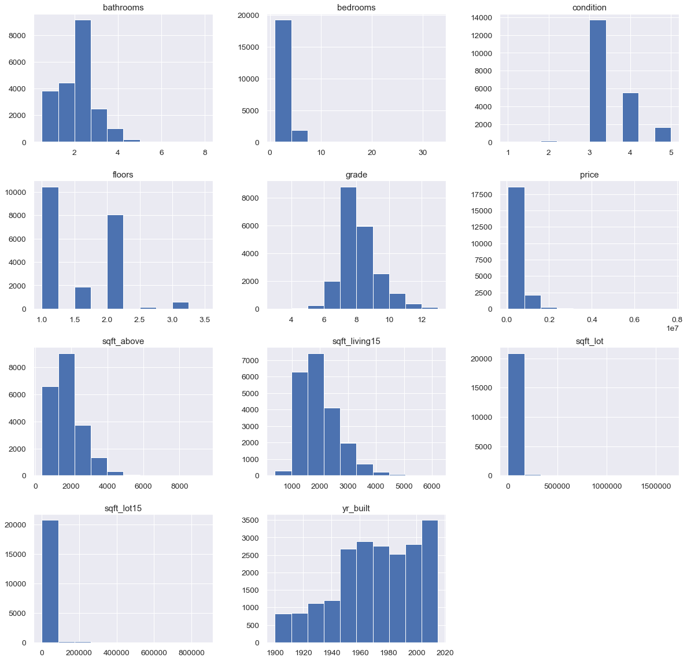


```python
# bin the year built
bins_yr_built = pd.cut(x =data['yr_built'], bins=[1889, 1930,1960,1990,2015] )
```


```python
# Using pd.cut() returns unordered categories. Transform this to ordered categories 
bins_yr_built =  bins_yr_built.cat.as_ordered()
bins_yr_built.head()
```


    0    (1930, 1960]
    1    (1930, 1960]
    2    (1930, 1960]
    3    (1960, 1990]
    4    (1960, 1990]
    Name: yr_built, dtype: category
    Categories (4, interval[int64]): [(1889, 1930] < (1930, 1960] < (1960, 1990] < (1990, 2015]]


```python
 #Inspect the result
bins_yr_built.value_counts().plot(kind='bar')
```


    <matplotlib.axes._subplots.AxesSubplot at 0x1c5d9221748>


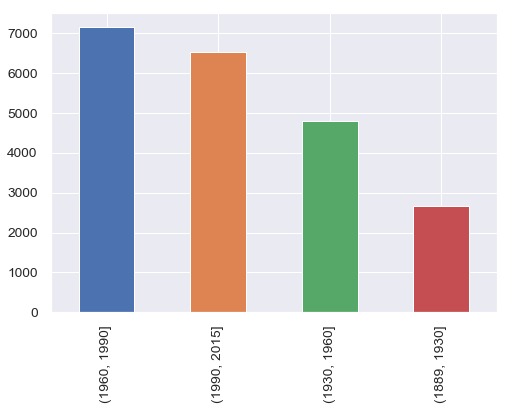


```python
#inserting binned year built into dataset
data['yr_built'] = bins_yr_built
data['yr_built'] = data['yr_built'].cat.codes
data.head(10)
```


<div>
<style scoped>
    .dataframe tbody tr th:only-of-type {
        vertical-align: middle;
    }

    .dataframe tbody tr th {
        vertical-align: top;
    }

    .dataframe thead th {
        text-align: right;
    }
</style>
<table border="1" class="dataframe">
  <thead>
    <tr style="text-align: right;">
      <th></th>
      <th>price</th>
      <th>bedrooms</th>
      <th>bathrooms</th>
      <th>sqft_lot</th>
      <th>floors</th>
      <th>condition</th>
      <th>grade</th>
      <th>sqft_above</th>
      <th>yr_built</th>
      <th>sqft_living15</th>
      <th>sqft_lot15</th>
    </tr>
  </thead>
  <tbody>
    <tr>
      <th>0</th>
      <td>221900.0</td>
      <td>3</td>
      <td>1.00</td>
      <td>5650</td>
      <td>1.0</td>
      <td>3</td>
      <td>7</td>
      <td>1180</td>
      <td>1</td>
      <td>1340</td>
      <td>5650</td>
    </tr>
    <tr>
      <th>1</th>
      <td>538000.0</td>
      <td>3</td>
      <td>2.25</td>
      <td>7242</td>
      <td>2.0</td>
      <td>3</td>
      <td>7</td>
      <td>2170</td>
      <td>1</td>
      <td>1690</td>
      <td>7639</td>
    </tr>
    <tr>
      <th>2</th>
      <td>180000.0</td>
      <td>2</td>
      <td>1.00</td>
      <td>10000</td>
      <td>1.0</td>
      <td>3</td>
      <td>6</td>
      <td>770</td>
      <td>1</td>
      <td>2720</td>
      <td>8062</td>
    </tr>
    <tr>
      <th>3</th>
      <td>604000.0</td>
      <td>4</td>
      <td>3.00</td>
      <td>5000</td>
      <td>1.0</td>
      <td>5</td>
      <td>7</td>
      <td>1050</td>
      <td>2</td>
      <td>1360</td>
      <td>5000</td>
    </tr>
    <tr>
      <th>4</th>
      <td>510000.0</td>
      <td>3</td>
      <td>2.00</td>
      <td>8080</td>
      <td>1.0</td>
      <td>3</td>
      <td>8</td>
      <td>1680</td>
      <td>2</td>
      <td>1800</td>
      <td>7503</td>
    </tr>
    <tr>
      <th>5</th>
      <td>1230000.0</td>
      <td>4</td>
      <td>4.50</td>
      <td>101930</td>
      <td>1.0</td>
      <td>3</td>
      <td>11</td>
      <td>3890</td>
      <td>3</td>
      <td>4760</td>
      <td>101930</td>
    </tr>
    <tr>
      <th>7</th>
      <td>291850.0</td>
      <td>3</td>
      <td>1.50</td>
      <td>9711</td>
      <td>1.0</td>
      <td>3</td>
      <td>7</td>
      <td>1060</td>
      <td>2</td>
      <td>1650</td>
      <td>9711</td>
    </tr>
    <tr>
      <th>8</th>
      <td>229500.0</td>
      <td>3</td>
      <td>1.00</td>
      <td>7470</td>
      <td>1.0</td>
      <td>3</td>
      <td>7</td>
      <td>1050</td>
      <td>1</td>
      <td>1780</td>
      <td>8113</td>
    </tr>
    <tr>
      <th>9</th>
      <td>323000.0</td>
      <td>3</td>
      <td>2.50</td>
      <td>6560</td>
      <td>2.0</td>
      <td>3</td>
      <td>7</td>
      <td>1890</td>
      <td>3</td>
      <td>2390</td>
      <td>7570</td>
    </tr>
    <tr>
      <th>10</th>
      <td>662500.0</td>
      <td>3</td>
      <td>2.50</td>
      <td>9796</td>
      <td>1.0</td>
      <td>3</td>
      <td>8</td>
      <td>1860</td>
      <td>2</td>
      <td>2210</td>
      <td>8925</td>
    </tr>
  </tbody>
</table>
</div>


### Scaling


```python
# scaling 
from sklearn.preprocessing import StandardScaler

scaler = StandardScaler()

cols = data.drop('price', axis=1).columns

#data_clean = pd.DataFrame(data['price'])
for col in cols:
    var =scaler.fit_transform(data[col].values.reshape(-1, 1))
    data[col]= var.flatten()
data.describe().round(3)
    
```


<div>
<style scoped>
    .dataframe tbody tr th:only-of-type {
        vertical-align: middle;
    }

    .dataframe tbody tr th {
        vertical-align: top;
    }

    .dataframe thead th {
        text-align: right;
    }
</style>
<table border="1" class="dataframe">
  <thead>
    <tr style="text-align: right;">
      <th></th>
      <th>price</th>
      <th>bedrooms</th>
      <th>bathrooms</th>
      <th>sqft_lot</th>
      <th>floors</th>
      <th>condition</th>
      <th>grade</th>
      <th>sqft_above</th>
      <th>yr_built</th>
      <th>sqft_living15</th>
      <th>sqft_lot15</th>
    </tr>
  </thead>
  <tbody>
    <tr>
      <th>count</th>
      <td>21139.000</td>
      <td>21139.000</td>
      <td>21139.000</td>
      <td>21139.000</td>
      <td>21139.000</td>
      <td>21139.000</td>
      <td>21139.000</td>
      <td>21139.000</td>
      <td>21139.000</td>
      <td>21139.000</td>
      <td>21139.000</td>
    </tr>
    <tr>
      <th>mean</th>
      <td>540521.730</td>
      <td>-0.000</td>
      <td>0.000</td>
      <td>0.000</td>
      <td>-0.000</td>
      <td>0.000</td>
      <td>-0.000</td>
      <td>0.000</td>
      <td>-0.000</td>
      <td>0.000</td>
      <td>-0.000</td>
    </tr>
    <tr>
      <th>std</th>
      <td>368104.682</td>
      <td>1.000</td>
      <td>1.000</td>
      <td>1.000</td>
      <td>1.000</td>
      <td>1.000</td>
      <td>1.000</td>
      <td>1.000</td>
      <td>1.000</td>
      <td>1.000</td>
      <td>1.000</td>
    </tr>
    <tr>
      <th>min</th>
      <td>78000.000</td>
      <td>-2.565</td>
      <td>-2.103</td>
      <td>-0.354</td>
      <td>-0.915</td>
      <td>-3.705</td>
      <td>-3.967</td>
      <td>-1.713</td>
      <td>-1.821</td>
      <td>-2.316</td>
      <td>-0.445</td>
    </tr>
    <tr>
      <th>25%</th>
      <td>322000.000</td>
      <td>-0.403</td>
      <td>-0.476</td>
      <td>-0.244</td>
      <td>-0.915</td>
      <td>-0.630</td>
      <td>-0.560</td>
      <td>-0.711</td>
      <td>-0.826</td>
      <td>-0.725</td>
      <td>-0.281</td>
    </tr>
    <tr>
      <th>50%</th>
      <td>450000.000</td>
      <td>-0.403</td>
      <td>0.174</td>
      <td>-0.181</td>
      <td>0.012</td>
      <td>-0.630</td>
      <td>-0.560</td>
      <td>-0.277</td>
      <td>0.170</td>
      <td>-0.215</td>
      <td>-0.188</td>
    </tr>
    <tr>
      <th>75%</th>
      <td>645000.000</td>
      <td>0.678</td>
      <td>0.500</td>
      <td>-0.107</td>
      <td>0.940</td>
      <td>0.907</td>
      <td>0.291</td>
      <td>0.508</td>
      <td>1.165</td>
      <td>0.544</td>
      <td>-0.098</td>
    </tr>
    <tr>
      <th>max</th>
      <td>7700000.000</td>
      <td>32.032</td>
      <td>7.656</td>
      <td>39.704</td>
      <td>3.722</td>
      <td>2.444</td>
      <td>4.549</td>
      <td>9.199</td>
      <td>1.165</td>
      <td>6.158</td>
      <td>31.595</td>
    </tr>
  </tbody>
</table>
</div>


```python
#getting data betweem -3 and 3 tot take care of the outliers
df = data.drop('price', axis=1)[np.abs(data) < 3]
df['price'] = data['price']
df.head(30)
```


<div>
<style scoped>
    .dataframe tbody tr th:only-of-type {
        vertical-align: middle;
    }

    .dataframe tbody tr th {
        vertical-align: top;
    }

    .dataframe thead th {
        text-align: right;
    }
</style>
<table border="1" class="dataframe">
  <thead>
    <tr style="text-align: right;">
      <th></th>
      <th>bedrooms</th>
      <th>bathrooms</th>
      <th>sqft_lot</th>
      <th>floors</th>
      <th>condition</th>
      <th>grade</th>
      <th>sqft_above</th>
      <th>yr_built</th>
      <th>sqft_living15</th>
      <th>sqft_lot15</th>
      <th>price</th>
    </tr>
  </thead>
  <tbody>
    <tr>
      <th>0</th>
      <td>-0.402926</td>
      <td>-1.452091</td>
      <td>-0.229049</td>
      <td>-0.915226</td>
      <td>-0.630266</td>
      <td>-0.560432</td>
      <td>-0.735260</td>
      <td>-0.825585</td>
      <td>-0.944069</td>
      <td>-0.260968</td>
      <td>221900.0</td>
    </tr>
    <tr>
      <th>1</th>
      <td>-0.402926</td>
      <td>0.174295</td>
      <td>-0.190420</td>
      <td>0.939530</td>
      <td>-0.630266</td>
      <td>-0.560432</td>
      <td>0.459781</td>
      <td>-0.825585</td>
      <td>-0.433626</td>
      <td>-0.187764</td>
      <td>538000.0</td>
    </tr>
    <tr>
      <th>2</th>
      <td>-1.484097</td>
      <td>-1.452091</td>
      <td>-0.123497</td>
      <td>-0.915226</td>
      <td>-0.630266</td>
      <td>-1.412057</td>
      <td>-1.230175</td>
      <td>-0.825585</td>
      <td>1.068536</td>
      <td>-0.172196</td>
      <td>180000.0</td>
    </tr>
    <tr>
      <th>3</th>
      <td>0.678244</td>
      <td>1.150126</td>
      <td>-0.244822</td>
      <td>-0.915226</td>
      <td>2.444197</td>
      <td>-0.560432</td>
      <td>-0.892184</td>
      <td>0.169627</td>
      <td>-0.914901</td>
      <td>-0.284890</td>
      <td>604000.0</td>
    </tr>
    <tr>
      <th>4</th>
      <td>-0.402926</td>
      <td>-0.150983</td>
      <td>-0.170086</td>
      <td>-0.915226</td>
      <td>-0.630266</td>
      <td>0.291194</td>
      <td>-0.131704</td>
      <td>0.169627</td>
      <td>-0.273201</td>
      <td>-0.192770</td>
      <td>510000.0</td>
    </tr>
    <tr>
      <th>5</th>
      <td>0.678244</td>
      <td>NaN</td>
      <td>2.107177</td>
      <td>-0.915226</td>
      <td>-0.630266</td>
      <td>2.846070</td>
      <td>2.536012</td>
      <td>1.164839</td>
      <td>NaN</td>
      <td>NaN</td>
      <td>1230000.0</td>
    </tr>
    <tr>
      <th>7</th>
      <td>-0.402926</td>
      <td>-0.801537</td>
      <td>-0.130510</td>
      <td>-0.915226</td>
      <td>-0.630266</td>
      <td>-0.560432</td>
      <td>-0.880113</td>
      <td>0.169627</td>
      <td>-0.491962</td>
      <td>-0.111506</td>
      <td>291850.0</td>
    </tr>
    <tr>
      <th>8</th>
      <td>-0.402926</td>
      <td>-1.452091</td>
      <td>-0.184887</td>
      <td>-0.915226</td>
      <td>-0.630266</td>
      <td>-0.560432</td>
      <td>-0.892184</td>
      <td>-0.825585</td>
      <td>-0.302369</td>
      <td>-0.170319</td>
      <td>229500.0</td>
    </tr>
    <tr>
      <th>9</th>
      <td>-0.402926</td>
      <td>0.499572</td>
      <td>-0.206968</td>
      <td>0.939530</td>
      <td>-0.630266</td>
      <td>-0.560432</td>
      <td>0.121789</td>
      <td>1.164839</td>
      <td>0.587260</td>
      <td>-0.190304</td>
      <td>323000.0</td>
    </tr>
    <tr>
      <th>10</th>
      <td>-0.402926</td>
      <td>0.499572</td>
      <td>-0.128447</td>
      <td>-0.915226</td>
      <td>-0.630266</td>
      <td>0.291194</td>
      <td>0.085576</td>
      <td>0.169627</td>
      <td>0.324747</td>
      <td>-0.140434</td>
      <td>662500.0</td>
    </tr>
    <tr>
      <th>11</th>
      <td>-1.484097</td>
      <td>-1.452091</td>
      <td>-0.220557</td>
      <td>-0.915226</td>
      <td>0.906966</td>
      <td>-0.560432</td>
      <td>-1.121535</td>
      <td>-0.825585</td>
      <td>-0.958653</td>
      <td>-0.248086</td>
      <td>468000.0</td>
    </tr>
    <tr>
      <th>12</th>
      <td>-0.402926</td>
      <td>-1.452091</td>
      <td>0.116750</td>
      <td>0.012152</td>
      <td>0.906966</td>
      <td>-0.560432</td>
      <td>-0.433482</td>
      <td>-1.820797</td>
      <td>-0.302369</td>
      <td>-0.001609</td>
      <td>310000.0</td>
    </tr>
    <tr>
      <th>13</th>
      <td>-0.402926</td>
      <td>-0.476260</td>
      <td>-0.131262</td>
      <td>-0.915226</td>
      <td>0.906966</td>
      <td>-0.560432</td>
      <td>-0.505908</td>
      <td>0.169627</td>
      <td>-0.900317</td>
      <td>-0.093215</td>
      <td>400000.0</td>
    </tr>
    <tr>
      <th>14</th>
      <td>1.759415</td>
      <td>-0.150983</td>
      <td>-0.248461</td>
      <td>0.012152</td>
      <td>-0.630266</td>
      <td>-0.560432</td>
      <td>0.025221</td>
      <td>-1.820797</td>
      <td>-0.914901</td>
      <td>-0.290411</td>
      <td>530000.0</td>
    </tr>
    <tr>
      <th>15</th>
      <td>0.678244</td>
      <td>1.150126</td>
      <td>-0.244822</td>
      <td>0.939530</td>
      <td>-0.630266</td>
      <td>1.142819</td>
      <td>0.230429</td>
      <td>0.169627</td>
      <td>0.222658</td>
      <td>-0.321695</td>
      <td>650000.0</td>
    </tr>
    <tr>
      <th>16</th>
      <td>-0.402926</td>
      <td>-0.150983</td>
      <td>-0.025467</td>
      <td>0.939530</td>
      <td>-0.630266</td>
      <td>-0.560432</td>
      <td>0.121789</td>
      <td>1.164839</td>
      <td>-0.141944</td>
      <td>0.047009</td>
      <td>395000.0</td>
    </tr>
    <tr>
      <th>17</th>
      <td>0.678244</td>
      <td>-1.452091</td>
      <td>-0.261807</td>
      <td>0.012152</td>
      <td>0.906966</td>
      <td>-0.560432</td>
      <td>-0.228273</td>
      <td>-1.820797</td>
      <td>-0.550299</td>
      <td>-0.310653</td>
      <td>485000.0</td>
    </tr>
    <tr>
      <th>19</th>
      <td>-0.402926</td>
      <td>-1.452091</td>
      <td>-0.128981</td>
      <td>-0.915226</td>
      <td>0.906966</td>
      <td>-0.560432</td>
      <td>-0.650762</td>
      <td>0.169627</td>
      <td>-1.031574</td>
      <td>-0.143195</td>
      <td>230000.0</td>
    </tr>
    <tr>
      <th>20</th>
      <td>0.678244</td>
      <td>-0.476260</td>
      <td>-0.245307</td>
      <td>-0.915226</td>
      <td>0.906966</td>
      <td>-0.560432</td>
      <td>-1.121535</td>
      <td>-0.825585</td>
      <td>-0.856565</td>
      <td>-0.285627</td>
      <td>385000.0</td>
    </tr>
    <tr>
      <th>21</th>
      <td>-0.402926</td>
      <td>0.824849</td>
      <td>0.722548</td>
      <td>-0.915226</td>
      <td>-0.630266</td>
      <td>1.142819</td>
      <td>0.652918</td>
      <td>0.169627</td>
      <td>NaN</td>
      <td>0.279538</td>
      <td>2000000.0</td>
    </tr>
    <tr>
      <th>22</th>
      <td>1.759415</td>
      <td>0.499572</td>
      <td>-0.213277</td>
      <td>0.939530</td>
      <td>-0.630266</td>
      <td>0.291194</td>
      <td>0.580492</td>
      <td>1.164839</td>
      <td>0.368499</td>
      <td>-0.211098</td>
      <td>285000.0</td>
    </tr>
    <tr>
      <th>23</th>
      <td>-1.484097</td>
      <td>-0.801537</td>
      <td>-0.132160</td>
      <td>-0.915226</td>
      <td>-0.630266</td>
      <td>-0.560432</td>
      <td>-0.868042</td>
      <td>0.169627</td>
      <td>-1.119078</td>
      <td>-0.160272</td>
      <td>252700.0</td>
    </tr>
    <tr>
      <th>24</th>
      <td>-0.402926</td>
      <td>0.174295</td>
      <td>-0.208424</td>
      <td>0.939530</td>
      <td>0.906966</td>
      <td>0.291194</td>
      <td>0.797772</td>
      <td>0.169627</td>
      <td>0.310163</td>
      <td>-0.216251</td>
      <td>329000.0</td>
    </tr>
    <tr>
      <th>25</th>
      <td>-0.402926</td>
      <td>-0.150983</td>
      <td>-0.252174</td>
      <td>0.012152</td>
      <td>2.444197</td>
      <td>-1.412057</td>
      <td>-0.095491</td>
      <td>-0.825585</td>
      <td>-1.396176</td>
      <td>-0.295748</td>
      <td>233000.0</td>
    </tr>
    <tr>
      <th>26</th>
      <td>-0.402926</td>
      <td>-0.476260</td>
      <td>-0.300849</td>
      <td>0.939530</td>
      <td>-0.630266</td>
      <td>0.291194</td>
      <td>-0.047206</td>
      <td>-1.820797</td>
      <td>-0.331537</td>
      <td>-0.337410</td>
      <td>937000.0</td>
    </tr>
    <tr>
      <th>27</th>
      <td>-0.402926</td>
      <td>-1.452091</td>
      <td>-0.327783</td>
      <td>0.012152</td>
      <td>2.444197</td>
      <td>0.291194</td>
      <td>-0.469695</td>
      <td>-1.820797</td>
      <td>-0.185697</td>
      <td>-0.326810</td>
      <td>667000.0</td>
    </tr>
    <tr>
      <th>28</th>
      <td>-0.402926</td>
      <td>-0.476260</td>
      <td>-0.211336</td>
      <td>-0.915226</td>
      <td>-0.630266</td>
      <td>-0.560432</td>
      <td>-1.206033</td>
      <td>-0.825585</td>
      <td>-0.681556</td>
      <td>-0.239437</td>
      <td>438000.0</td>
    </tr>
    <tr>
      <th>29</th>
      <td>0.678244</td>
      <td>0.499572</td>
      <td>-0.192094</td>
      <td>0.939530</td>
      <td>-0.630266</td>
      <td>0.291194</td>
      <td>0.942625</td>
      <td>1.164839</td>
      <td>0.937279</td>
      <td>-0.247129</td>
      <td>719000.0</td>
    </tr>
    <tr>
      <th>30</th>
      <td>-0.402926</td>
      <td>0.499572</td>
      <td>-0.269572</td>
      <td>0.939530</td>
      <td>-0.630266</td>
      <td>0.291194</td>
      <td>0.640847</td>
      <td>1.164839</td>
      <td>0.864358</td>
      <td>-0.322431</td>
      <td>580500.0</td>
    </tr>
    <tr>
      <th>31</th>
      <td>-1.484097</td>
      <td>-0.801537</td>
      <td>-0.335451</td>
      <td>2.794286</td>
      <td>-0.630266</td>
      <td>-0.560432</td>
      <td>-0.723188</td>
      <td>1.164839</td>
      <td>-0.871149</td>
      <td>-0.404283</td>
      <td>280000.0</td>
    </tr>
  </tbody>
</table>
</div>


```python
# dropping the nan values
df = df.dropna()
```


```python
#checking the data
df.head()
```


<div>
<style scoped>
    .dataframe tbody tr th:only-of-type {
        vertical-align: middle;
    }

    .dataframe tbody tr th {
        vertical-align: top;
    }

    .dataframe thead th {
        text-align: right;
    }
</style>
<table border="1" class="dataframe">
  <thead>
    <tr style="text-align: right;">
      <th></th>
      <th>bedrooms</th>
      <th>bathrooms</th>
      <th>sqft_lot</th>
      <th>floors</th>
      <th>condition</th>
      <th>grade</th>
      <th>sqft_above</th>
      <th>yr_built</th>
      <th>sqft_living15</th>
      <th>sqft_lot15</th>
      <th>price</th>
    </tr>
  </thead>
  <tbody>
    <tr>
      <th>0</th>
      <td>-0.402926</td>
      <td>-1.452091</td>
      <td>-0.229049</td>
      <td>-0.915226</td>
      <td>-0.630266</td>
      <td>-0.560432</td>
      <td>-0.735260</td>
      <td>-0.825585</td>
      <td>-0.944069</td>
      <td>-0.260968</td>
      <td>221900.0</td>
    </tr>
    <tr>
      <th>1</th>
      <td>-0.402926</td>
      <td>0.174295</td>
      <td>-0.190420</td>
      <td>0.939530</td>
      <td>-0.630266</td>
      <td>-0.560432</td>
      <td>0.459781</td>
      <td>-0.825585</td>
      <td>-0.433626</td>
      <td>-0.187764</td>
      <td>538000.0</td>
    </tr>
    <tr>
      <th>2</th>
      <td>-1.484097</td>
      <td>-1.452091</td>
      <td>-0.123497</td>
      <td>-0.915226</td>
      <td>-0.630266</td>
      <td>-1.412057</td>
      <td>-1.230175</td>
      <td>-0.825585</td>
      <td>1.068536</td>
      <td>-0.172196</td>
      <td>180000.0</td>
    </tr>
    <tr>
      <th>3</th>
      <td>0.678244</td>
      <td>1.150126</td>
      <td>-0.244822</td>
      <td>-0.915226</td>
      <td>2.444197</td>
      <td>-0.560432</td>
      <td>-0.892184</td>
      <td>0.169627</td>
      <td>-0.914901</td>
      <td>-0.284890</td>
      <td>604000.0</td>
    </tr>
    <tr>
      <th>4</th>
      <td>-0.402926</td>
      <td>-0.150983</td>
      <td>-0.170086</td>
      <td>-0.915226</td>
      <td>-0.630266</td>
      <td>0.291194</td>
      <td>-0.131704</td>
      <td>0.169627</td>
      <td>-0.273201</td>
      <td>-0.192770</td>
      <td>510000.0</td>
    </tr>
  </tbody>
</table>
</div>


```python

```


```python
df.describe().round(3)
```


<div>
<style scoped>
    .dataframe tbody tr th:only-of-type {
        vertical-align: middle;
    }

    .dataframe tbody tr th {
        vertical-align: top;
    }

    .dataframe thead th {
        text-align: right;
    }
</style>
<table border="1" class="dataframe">
  <thead>
    <tr style="text-align: right;">
      <th></th>
      <th>bedrooms</th>
      <th>bathrooms</th>
      <th>sqft_lot</th>
      <th>floors</th>
      <th>condition</th>
      <th>grade</th>
      <th>sqft_above</th>
      <th>yr_built</th>
      <th>sqft_living15</th>
      <th>sqft_lot15</th>
      <th>price</th>
    </tr>
  </thead>
  <tbody>
    <tr>
      <th>count</th>
      <td>20116.000</td>
      <td>20116.000</td>
      <td>20116.000</td>
      <td>20116.000</td>
      <td>20116.000</td>
      <td>20116.000</td>
      <td>20116.000</td>
      <td>20116.000</td>
      <td>20116.000</td>
      <td>20116.000</td>
      <td>20116.000</td>
    </tr>
    <tr>
      <th>mean</th>
      <td>-0.034</td>
      <td>-0.062</td>
      <td>-0.119</td>
      <td>-0.021</td>
      <td>0.015</td>
      <td>-0.059</td>
      <td>-0.082</td>
      <td>-0.020</td>
      <td>-0.068</td>
      <td>-0.125</td>
      <td>513754.333</td>
    </tr>
    <tr>
      <th>std</th>
      <td>0.927</td>
      <td>0.916</td>
      <td>0.289</td>
      <td>0.997</td>
      <td>0.995</td>
      <td>0.909</td>
      <td>0.870</td>
      <td>0.999</td>
      <td>0.907</td>
      <td>0.339</td>
      <td>297494.092</td>
    </tr>
    <tr>
      <th>min</th>
      <td>-2.565</td>
      <td>-2.103</td>
      <td>-0.354</td>
      <td>-0.915</td>
      <td>-2.167</td>
      <td>-2.264</td>
      <td>-1.713</td>
      <td>-1.821</td>
      <td>-2.227</td>
      <td>-0.445</td>
      <td>82000.000</td>
    </tr>
    <tr>
      <th>25%</th>
      <td>-0.403</td>
      <td>-0.802</td>
      <td>-0.245</td>
      <td>-0.915</td>
      <td>-0.630</td>
      <td>-0.560</td>
      <td>-0.735</td>
      <td>-0.826</td>
      <td>-0.754</td>
      <td>-0.284</td>
      <td>319000.000</td>
    </tr>
    <tr>
      <th>50%</th>
      <td>-0.403</td>
      <td>0.174</td>
      <td>-0.184</td>
      <td>-0.915</td>
      <td>-0.630</td>
      <td>-0.560</td>
      <td>-0.313</td>
      <td>0.170</td>
      <td>-0.244</td>
      <td>-0.193</td>
      <td>444250.000</td>
    </tr>
    <tr>
      <th>75%</th>
      <td>0.678</td>
      <td>0.500</td>
      <td>-0.120</td>
      <td>0.940</td>
      <td>0.907</td>
      <td>0.291</td>
      <td>0.411</td>
      <td>1.165</td>
      <td>0.471</td>
      <td>-0.110</td>
      <td>625000.000</td>
    </tr>
    <tr>
      <th>max</th>
      <td>2.841</td>
      <td>2.777</td>
      <td>2.963</td>
      <td>2.794</td>
      <td>2.444</td>
      <td>2.846</td>
      <td>2.995</td>
      <td>1.165</td>
      <td>2.997</td>
      <td>2.984</td>
      <td>3600000.000</td>
    </tr>
  </tbody>
</table>
</div>


```python
#selecting data excluding price
data_pred = df.iloc[:,:10]
data_pred.head()
```


<div>
<style scoped>
    .dataframe tbody tr th:only-of-type {
        vertical-align: middle;
    }

    .dataframe tbody tr th {
        vertical-align: top;
    }

    .dataframe thead th {
        text-align: right;
    }
</style>
<table border="1" class="dataframe">
  <thead>
    <tr style="text-align: right;">
      <th></th>
      <th>bedrooms</th>
      <th>bathrooms</th>
      <th>sqft_lot</th>
      <th>floors</th>
      <th>condition</th>
      <th>grade</th>
      <th>sqft_above</th>
      <th>yr_built</th>
      <th>sqft_living15</th>
      <th>sqft_lot15</th>
    </tr>
  </thead>
  <tbody>
    <tr>
      <th>0</th>
      <td>-0.402926</td>
      <td>-1.452091</td>
      <td>-0.229049</td>
      <td>-0.915226</td>
      <td>-0.630266</td>
      <td>-0.560432</td>
      <td>-0.735260</td>
      <td>-0.825585</td>
      <td>-0.944069</td>
      <td>-0.260968</td>
    </tr>
    <tr>
      <th>1</th>
      <td>-0.402926</td>
      <td>0.174295</td>
      <td>-0.190420</td>
      <td>0.939530</td>
      <td>-0.630266</td>
      <td>-0.560432</td>
      <td>0.459781</td>
      <td>-0.825585</td>
      <td>-0.433626</td>
      <td>-0.187764</td>
    </tr>
    <tr>
      <th>2</th>
      <td>-1.484097</td>
      <td>-1.452091</td>
      <td>-0.123497</td>
      <td>-0.915226</td>
      <td>-0.630266</td>
      <td>-1.412057</td>
      <td>-1.230175</td>
      <td>-0.825585</td>
      <td>1.068536</td>
      <td>-0.172196</td>
    </tr>
    <tr>
      <th>3</th>
      <td>0.678244</td>
      <td>1.150126</td>
      <td>-0.244822</td>
      <td>-0.915226</td>
      <td>2.444197</td>
      <td>-0.560432</td>
      <td>-0.892184</td>
      <td>0.169627</td>
      <td>-0.914901</td>
      <td>-0.284890</td>
    </tr>
    <tr>
      <th>4</th>
      <td>-0.402926</td>
      <td>-0.150983</td>
      <td>-0.170086</td>
      <td>-0.915226</td>
      <td>-0.630266</td>
      <td>0.291194</td>
      <td>-0.131704</td>
      <td>0.169627</td>
      <td>-0.273201</td>
      <td>-0.192770</td>
    </tr>
  </tbody>
</table>
</div>


```python
#checking histogram
data_pred.hist(figsize = [10,12]);
```


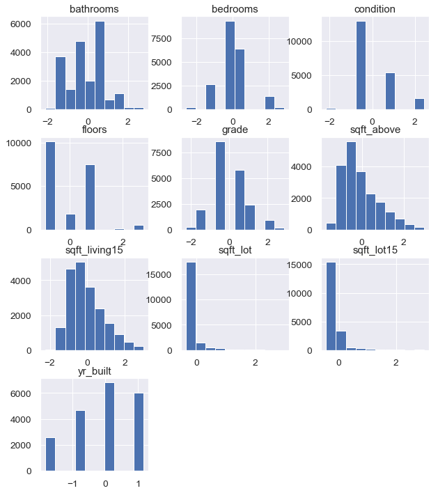


```python
# dropping sqft_lot since i dont plan to use it in the
#data_pred = data_pred.drop('sqft_lot', axis=1)
```

# Model


```python
price = df['price']
data_ols = pd.concat([price, data_pred], axis=1)
data_ols.head(10)
```


<div>
<style scoped>
    .dataframe tbody tr th:only-of-type {
        vertical-align: middle;
    }

    .dataframe tbody tr th {
        vertical-align: top;
    }

    .dataframe thead th {
        text-align: right;
    }
</style>
<table border="1" class="dataframe">
  <thead>
    <tr style="text-align: right;">
      <th></th>
      <th>price</th>
      <th>bedrooms</th>
      <th>bathrooms</th>
      <th>sqft_lot</th>
      <th>floors</th>
      <th>condition</th>
      <th>grade</th>
      <th>sqft_above</th>
      <th>yr_built</th>
      <th>sqft_living15</th>
      <th>sqft_lot15</th>
    </tr>
  </thead>
  <tbody>
    <tr>
      <th>0</th>
      <td>221900.0</td>
      <td>-0.402926</td>
      <td>-1.452091</td>
      <td>-0.229049</td>
      <td>-0.915226</td>
      <td>-0.630266</td>
      <td>-0.560432</td>
      <td>-0.735260</td>
      <td>-0.825585</td>
      <td>-0.944069</td>
      <td>-0.260968</td>
    </tr>
    <tr>
      <th>1</th>
      <td>538000.0</td>
      <td>-0.402926</td>
      <td>0.174295</td>
      <td>-0.190420</td>
      <td>0.939530</td>
      <td>-0.630266</td>
      <td>-0.560432</td>
      <td>0.459781</td>
      <td>-0.825585</td>
      <td>-0.433626</td>
      <td>-0.187764</td>
    </tr>
    <tr>
      <th>2</th>
      <td>180000.0</td>
      <td>-1.484097</td>
      <td>-1.452091</td>
      <td>-0.123497</td>
      <td>-0.915226</td>
      <td>-0.630266</td>
      <td>-1.412057</td>
      <td>-1.230175</td>
      <td>-0.825585</td>
      <td>1.068536</td>
      <td>-0.172196</td>
    </tr>
    <tr>
      <th>3</th>
      <td>604000.0</td>
      <td>0.678244</td>
      <td>1.150126</td>
      <td>-0.244822</td>
      <td>-0.915226</td>
      <td>2.444197</td>
      <td>-0.560432</td>
      <td>-0.892184</td>
      <td>0.169627</td>
      <td>-0.914901</td>
      <td>-0.284890</td>
    </tr>
    <tr>
      <th>4</th>
      <td>510000.0</td>
      <td>-0.402926</td>
      <td>-0.150983</td>
      <td>-0.170086</td>
      <td>-0.915226</td>
      <td>-0.630266</td>
      <td>0.291194</td>
      <td>-0.131704</td>
      <td>0.169627</td>
      <td>-0.273201</td>
      <td>-0.192770</td>
    </tr>
    <tr>
      <th>7</th>
      <td>291850.0</td>
      <td>-0.402926</td>
      <td>-0.801537</td>
      <td>-0.130510</td>
      <td>-0.915226</td>
      <td>-0.630266</td>
      <td>-0.560432</td>
      <td>-0.880113</td>
      <td>0.169627</td>
      <td>-0.491962</td>
      <td>-0.111506</td>
    </tr>
    <tr>
      <th>8</th>
      <td>229500.0</td>
      <td>-0.402926</td>
      <td>-1.452091</td>
      <td>-0.184887</td>
      <td>-0.915226</td>
      <td>-0.630266</td>
      <td>-0.560432</td>
      <td>-0.892184</td>
      <td>-0.825585</td>
      <td>-0.302369</td>
      <td>-0.170319</td>
    </tr>
    <tr>
      <th>9</th>
      <td>323000.0</td>
      <td>-0.402926</td>
      <td>0.499572</td>
      <td>-0.206968</td>
      <td>0.939530</td>
      <td>-0.630266</td>
      <td>-0.560432</td>
      <td>0.121789</td>
      <td>1.164839</td>
      <td>0.587260</td>
      <td>-0.190304</td>
    </tr>
    <tr>
      <th>10</th>
      <td>662500.0</td>
      <td>-0.402926</td>
      <td>0.499572</td>
      <td>-0.128447</td>
      <td>-0.915226</td>
      <td>-0.630266</td>
      <td>0.291194</td>
      <td>0.085576</td>
      <td>0.169627</td>
      <td>0.324747</td>
      <td>-0.140434</td>
    </tr>
    <tr>
      <th>11</th>
      <td>468000.0</td>
      <td>-1.484097</td>
      <td>-1.452091</td>
      <td>-0.220557</td>
      <td>-0.915226</td>
      <td>0.906966</td>
      <td>-0.560432</td>
      <td>-1.121535</td>
      <td>-0.825585</td>
      <td>-0.958653</td>
      <td>-0.248086</td>
    </tr>
  </tbody>
</table>
</div>


```python
# importing statsmodels
import statsmodels.api as sm
from statsmodels.formula.api import ols
```


```python
#running model formula
outcome = 'price'
predictors = data_ols.drop(['price', 'condition'], axis=1)
pred_sum = "+".join(predictors.columns)
formula = outcome + "~" + pred_sum
```


```python
# getting the summy of the model
model = ols(formula= formula, data=data_ols).fit()
model.summary()
```


<table class="simpletable">
<caption>OLS Regression Results</caption>
<tr>
  <th>Dep. Variable:</th>          <td>price</td>      <th>  R-squared:         </th>  <td>   0.558</td>  
</tr>
<tr>
  <th>Model:</th>                   <td>OLS</td>       <th>  Adj. R-squared:    </th>  <td>   0.558</td>  
</tr>
<tr>
  <th>Method:</th>             <td>Least Squares</td>  <th>  F-statistic:       </th>  <td>   2824.</td>  
</tr>
<tr>
  <th>Date:</th>             <td>Thu, 07 Nov 2019</td> <th>  Prob (F-statistic):</th>   <td>  0.00</td>   
</tr>
<tr>
  <th>Time:</th>                 <td>16:24:31</td>     <th>  Log-Likelihood:    </th> <td>-2.7385e+05</td>
</tr>
<tr>
  <th>No. Observations:</th>      <td> 20116</td>      <th>  AIC:               </th>  <td>5.477e+05</td> 
</tr>
<tr>
  <th>Df Residuals:</th>          <td> 20106</td>      <th>  BIC:               </th>  <td>5.478e+05</td> 
</tr>
<tr>
  <th>Df Model:</th>              <td>     9</td>      <th>                     </th>      <td> </td>     
</tr>
<tr>
  <th>Covariance Type:</th>      <td>nonrobust</td>    <th>                     </th>      <td> </td>     
</tr>
</table>
<table class="simpletable">
<tr>
        <td></td>           <th>coef</th>     <th>std err</th>      <th>t</th>      <th>P>|t|</th>  <th>[0.025</th>    <th>0.975]</th>  
</tr>
<tr>
  <th>Intercept</th>     <td> 5.266e+05</td> <td> 1516.960</td> <td>  347.158</td> <td> 0.000</td> <td> 5.24e+05</td> <td>  5.3e+05</td>
</tr>
<tr>
  <th>bedrooms</th>      <td>-1.164e+04</td> <td> 1856.536</td> <td>   -6.268</td> <td> 0.000</td> <td>-1.53e+04</td> <td>-7998.465</td>
</tr>
<tr>
  <th>bathrooms</th>     <td> 6.683e+04</td> <td> 2388.331</td> <td>   27.981</td> <td> 0.000</td> <td> 6.21e+04</td> <td> 7.15e+04</td>
</tr>
<tr>
  <th>sqft_lot</th>      <td>  -46.8977</td> <td> 8372.110</td> <td>   -0.006</td> <td> 0.996</td> <td>-1.65e+04</td> <td> 1.64e+04</td>
</tr>
<tr>
  <th>floors</th>        <td> 2483.0064</td> <td> 1918.711</td> <td>    1.294</td> <td> 0.196</td> <td>-1277.825</td> <td> 6243.838</td>
</tr>
<tr>
  <th>grade</th>         <td> 1.608e+05</td> <td> 2506.783</td> <td>   64.127</td> <td> 0.000</td> <td> 1.56e+05</td> <td> 1.66e+05</td>
</tr>
<tr>
  <th>sqft_above</th>    <td> 3.453e+04</td> <td> 3025.783</td> <td>   11.411</td> <td> 0.000</td> <td> 2.86e+04</td> <td> 4.05e+04</td>
</tr>
<tr>
  <th>yr_built</th>      <td>-1.221e+05</td> <td> 1728.499</td> <td>  -70.630</td> <td> 0.000</td> <td>-1.25e+05</td> <td>-1.19e+05</td>
</tr>
<tr>
  <th>sqft_living15</th> <td> 6.577e+04</td> <td> 2493.189</td> <td>   26.380</td> <td> 0.000</td> <td> 6.09e+04</td> <td> 7.07e+04</td>
</tr>
<tr>
  <th>sqft_lot15</th>    <td>-4.208e+04</td> <td> 7197.874</td> <td>   -5.846</td> <td> 0.000</td> <td>-5.62e+04</td> <td> -2.8e+04</td>
</tr>
</table>
<table class="simpletable">
<tr>
  <th>Omnibus:</th>       <td>10811.325</td> <th>  Durbin-Watson:     </th>  <td>   1.975</td> 
</tr>
<tr>
  <th>Prob(Omnibus):</th>  <td> 0.000</td>   <th>  Jarque-Bera (JB):  </th> <td>181311.707</td>
</tr>
<tr>
  <th>Skew:</th>           <td> 2.210</td>   <th>  Prob(JB):          </th>  <td>    0.00</td> 
</tr>
<tr>
  <th>Kurtosis:</th>       <td>17.028</td>   <th>  Cond. No.          </th>  <td>    13.8</td> 
</tr>
</table><br/><br/>Warnings:<br/>[1] Standard Errors assume that the covariance matrix of the errors is correctly specified.


```python
#calling the parameters
coef = model.params
coef
```


    Intercept        526625.433254
    bedrooms         -11637.426808
    bathrooms         66828.188687
    sqft_lot            -46.897691
    floors             2483.006368
    grade            160753.590253
    sqft_above        34526.304935
    yr_built        -122084.582718
    sqft_living15     65771.347221
    sqft_lot15       -42079.351729
    dtype: float64


### Linear regression using Scikit learn


```python
from sklearn.linear_model import LinearRegression
```


```python
y = data_ols['price']
linreg = LinearRegression()
linreg.fit(predictors, y)
```


    LinearRegression(copy_X=True, fit_intercept=True, n_jobs=None, normalize=False)


```python
# coefficients
linreg.coef_
```


    array([-1.16374268e+04,  6.68281887e+04, -4.68976908e+01,  2.48300637e+03,
            1.60753590e+05,  3.45263049e+04, -1.22084583e+05,  6.57713472e+04,
           -4.20793517e+04])


```python
# intercept
linreg.intercept_
```


    526625.4332543842


## scatter plot and regression line for the model


```python
Sqft_living15 = data_ols['sqft_living15'].values
Price = data_ols['price'].values
```


```python
#regression line and scatter plot for price vs sqft_living15
Sqft_living15 = data_ols['sqft_living15'].values
Price = data_ols['price'].values

sns.regplot(x= Sqft_living15, y= Price)

plt.title("Price vs Sqft Living for neigboring houses")
plt.ylabel('Price')
plt.xlabel("sqft_living15")
```


    Text(0.5, 0, 'sqft_living15')


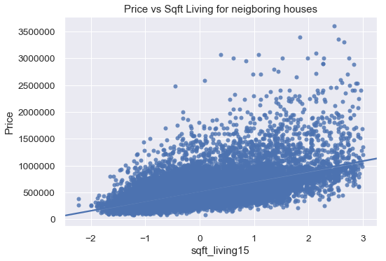


```python
#regression line and scatter plot for price vs sqft_above
Sqft_above = data_ols['sqft_above'].values
Price = data_ols['price'].values

sns.regplot(x= Sqft_above, y= Price)

plt.title("Price vs Sqft above ground")
plt.ylabel('Price')
plt.xlabel("sqft above ground")

```


    Text(0.5, 0, 'sqft above ground')


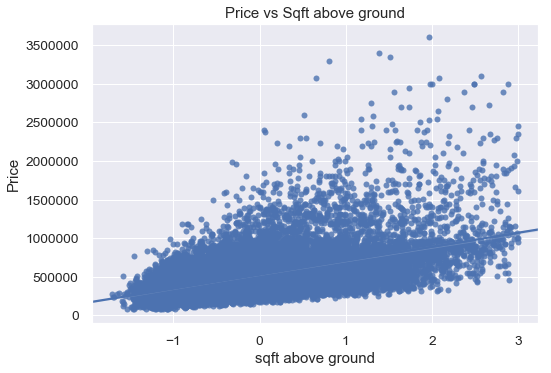


```python
#regression line and scatter plot for price vs grade
Grade = data_ols['grade'].values
Price = data_ols['price'].values

sns.regplot(x= Grade, y= Price)

plt.title("Price vs Grade")
plt.ylabel('Price')
plt.xlabel("Grade")
```


    Text(0.5, 0, 'Grade')


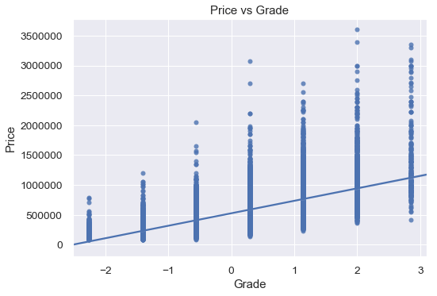


```python
#scatter plot for price vs bethrooms
Bathrooms = data_ols['bathrooms'].values
Price = data_ols['price'].values

sns.regplot(x= Bathrooms, y= Price)

plt.title("Price vs Bathrooms")
plt.ylabel('Price')
plt.xlabel("bathrooms")
```


    Text(0.5, 0, 'bathrooms')


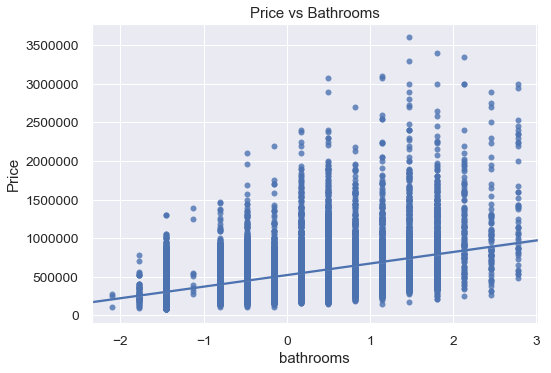


### QQplot


```python
resid1 = model.resid
fig = sm.graphics.qqplot(resid1, dist=stats.norm, line='45', fit=True)
```


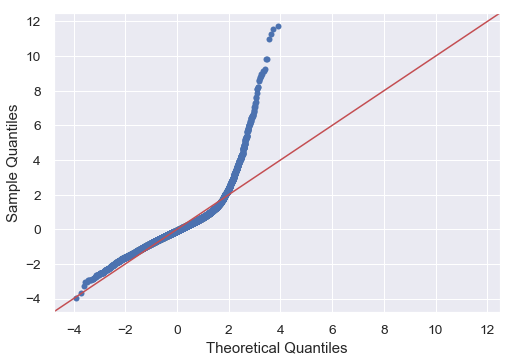


```python
# From the QQplot it is obvious that there is lighter mass on the top left end tail indicationg outliers
```


```python
# From the model the features that affect price significatly are sqft_living15, sqft_above, bathrooms, condition and grade.
# as these features increase so does the prices of the house
#Conclusion is that for the prices to increase we will need to renovate the house by increasing the square feet living of the house and encourage neighbors to do same
#increase in the number of bathrooms will also increase the price of the house
```

### recommendations

- Increase the number of bathrooms, 
- Increase sqft_above, 
- Improve the condition of the house(s)  
- improve the grade of the house.

